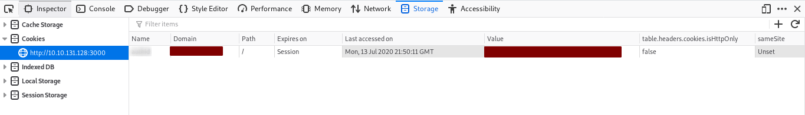
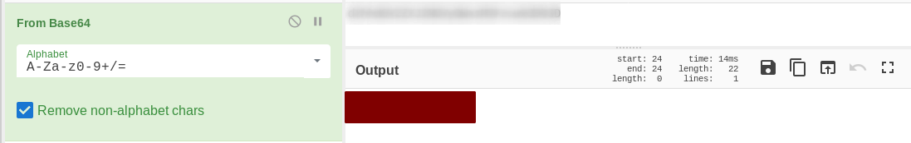
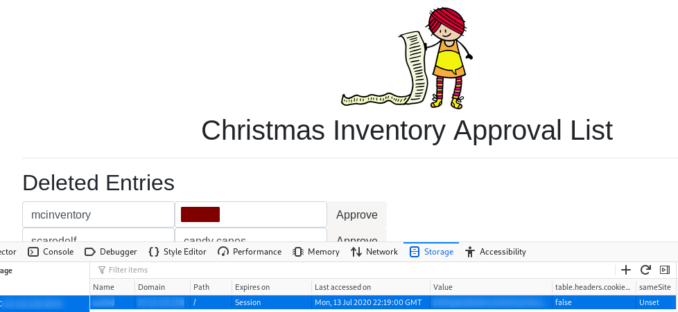
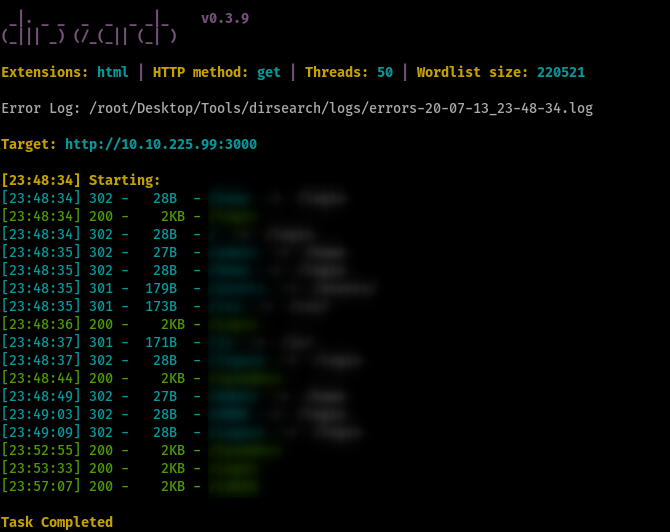
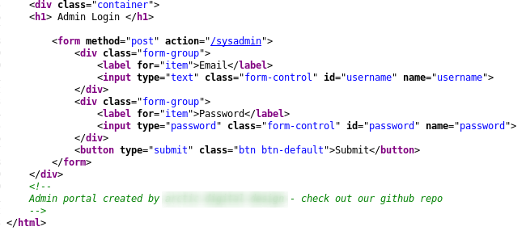
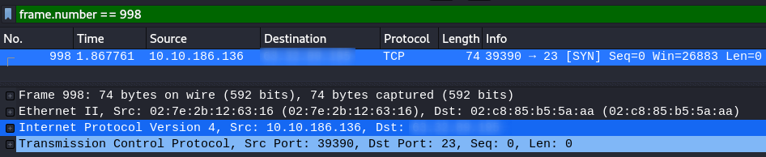
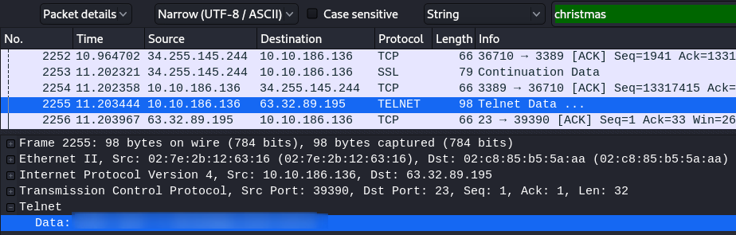
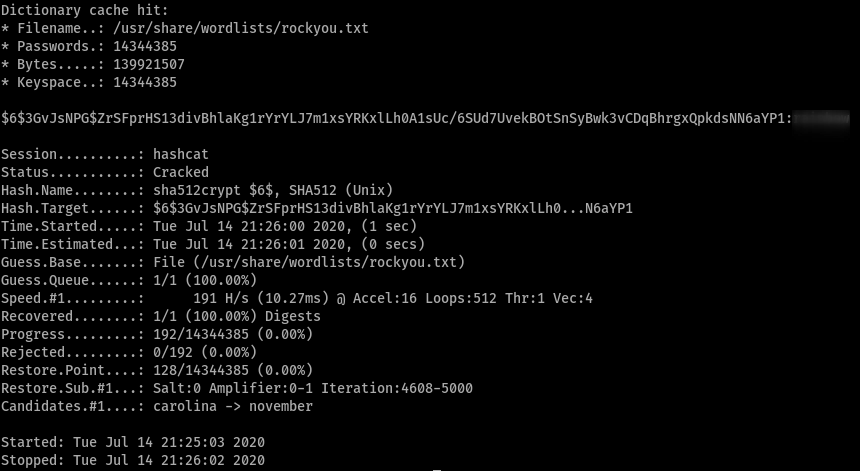

# Advent of Cyber

Get started with Cyber Security in 25 Days - Learn the basics by doing a new, beginner friendly security challenge every day leading up to Christmas.

## [Day 1] Inventory Management (Session Management)

Cookie and session management of a website / web application

1. What is the name of the cookie used for authentication?

   - Create an arbitrary account
   - Remember and login the authentication form with that credential
   - Checkout the inspector mode on your browser and find the cookie name with :

     - **Network** tab : look for the request packet and find its _Cookie_ header or _Cookies_ attribute
     - **Storage** tab : look for _Cookie_ storage

     

2. If you decode the cookie, what is the value of the fixed part of the cookie?

   - Cookies here are **_base64 encoded_** (lead can be found in attached doc)
   - We call the fixed part of cookie [salt](<https://en.wikipedia.org/wiki/Salt_(cryptography)>), in term of cryptography
   - Note : There is a **URL encoding** before it except value found in _Cookies_ attribute, which they are different in _special character encoding_ (eg. '=' is %3D)
   - Tool used : [Cyberchef](https://gchq.github.io/CyberChef/)

     

3. After accessing his account, what did the user mcinventory request?

   - Hint : here you need to login as user **_mcinventory_**
   - Encode the appended username with salt and replace the cookie value stored on your browser (Inspector mode)
   - Then, you will be login as user _mcinventory_, after refreshing the page
   - Look for the corresponding entry

     

## [Day 2] Arctic Forum (Bruteforce directory)

1. What is the path of the hidden page?

   - Tool used : [dirsearch](https://www.google.com/url?sa=t&rct=j&q=&esrc=s&source=web&cd=&cad=rja&uact=8&ved=2ahUKEwjK0aDdqsvqAhVVSxUIHd40C1sQFjAAegQIAxAB&url=https%3A%2F%2Fgithub.com%2Fmaurosoria%2Fdirsearch&usg=AOvVaw09pWqpI-PVNuVwz_h5SCtz)
   - Command used :

     ```Bash
     /path/to/dirsearch.py -u http://<IP_addr> -t <threads> -w /path/to/wordlist -e <extension>
     ```

     

2. What is the password you found?

   - Hint : View their source code and search as the message intends

     

3. What do you have to take to the 'partay'
   - You will get it when you login successfully with the open-source credential found
   - Find for the keyword `partay`

## [Day 3] Evil Elf (Wireshark & Password Cracking)

1. Whats the destination IP on packet number 998?

   - Wireshark filter attribute by _No_ : **frame.number**
   - Filter used : `frame.number==998`
   - [Reference](https://osqa-ask.wireshark.org/questions/7000/can-we-use-no-in-the-filter-expression)

     

2. What item is on the Christmas list?

   - Simply find the packet with payload 'christmas' and you can see a line of bash command where you can find the solution

     

3. Crack buddy's password !

   - Related packet can be found on the first telnet packet and right click on it to select Follow > TCP Stream (Stream 1)
   - Hashcat command used :

     ```Bash
        hashcat -m <hash_type> -a <attack_mode> </path/to/hash_file> </path/to/wordlist> --force
        # More info use command 'man hashcat'
     ```

     

## [Day 4] Training (Basic Linux filesystem & commands)

1. How many visible files are there in the home directory(excluding ./ and ../)?
   - It can be found by using command `ls -l` after access the VM through SSH
2. What is the content of file5?
   - Output file content by using command `cat <file>`
3. Which file contains the string ‘password’?

   - Find the string within all the files in current directory with command

     ```Bash
        grep -nrs "password" .
     ```

4. What is the IP address in a file in the home folder?

   - Find the string with pattern _REGEX_ in current directory with command

     ```Bash
        grep -nrE "*((25[0-5]|2[0-4][0-9]|[01]?[0-9][0-9]?)\.){3}(25[0-5]|2[0-4][0-9]|[01]?[0-9][0-9]?)*" .
     ```

5. How many users can log into the machine?

   - Hints :
     - `/home` is the main directory that contains home directories for personal users (non-root user)
     - Don't forget `root` user !
   - Command used :

     ```Bash
        cat /etc/passwd | grep "/bin/bash"
     ```

6. What is the sha1 hash of file8?

   - It means to find out the sha1-hashed content from file8
   - Hint : Command `sha1sum <FILE>`
   - Reference : <https://shapeshed.com/unix-sha1sum/>

7. What is mcsysadmin’s password hash?

   - Hint : We have no permission to read the file `/etc/shadow`, however there could be a _backup file_ to be found
   - Command Used :

     ```Bash
        find / -name "*shadow*" -exec ls -lt {} \; 2>/dev/null
     ```

## [Day 5] Ho-Ho-Hosint (OSINT with images)

Reference : <https://blog.tryhackme.com/ho-ho/>

## [Day 13] 1st CTFs on Windows Server 2016

- Connecting to Microsoft Terminal Services (Remote Desktop)
  - <https://superuser.com/questions/1534999/rdesktop-aborts-due-to-untrusted-certificate>
  - <https://linux.die.net/man/1/xfreerdp>
- Exploitation on hhudp.exe :
  - Exploitation [Details](https://nvd.nist.gov/vuln/detail/CVE-2019-1388)
  - [YT Demonstration](https://www.youtube.com/watch?v=3BQKpPNlTSo)
