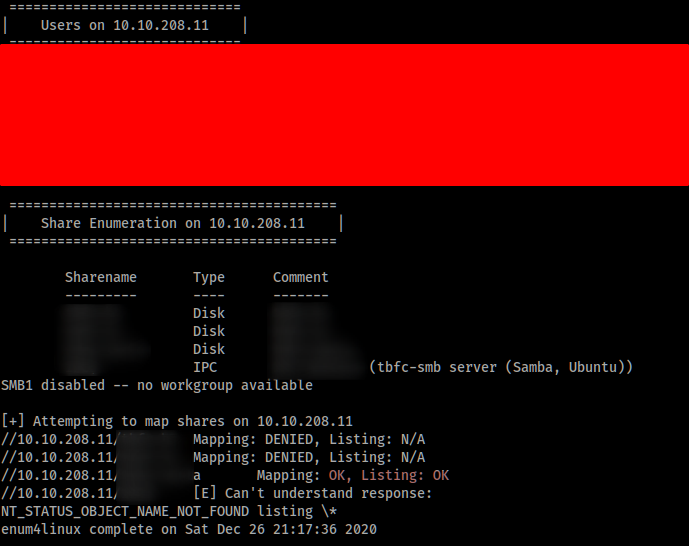

# Advent of Cyber 2

## [Day 3] Christmas Chaos

Here is an assisting [link](https://null-byte.wonderhowto.com/how-to/use-burp-foxyproxy-easily-switch-between-proxy-settings-0196630/) about how to setup Burp Suite proxy on Firefox Browser

- Dictionary Attack is a brute-force password attack that automating the login attempts with a list of credentials, and hoping that there is a combination that make the login attempt success
- [Hydra](https://github.com/vanhauser-thc/thc-hydra) is one of the quickest online credential crackers, which support various protocols such as HTTP, SSH and FTP
- In this task, we are going to use Burp Suite as a practice, which is an versatile pentesting tool for web application

## [Day 4] Santa's Watching

### About [Fuzzing](https://en.wikipedia.org/wiki/Fuzzing)

- Fuzzing is an automated software testing technique that involves providing invalid, unexpected, or random data as inputs to a computer program
- It is normally used to test programs that take structured inputs
- An effective fuzzer generates semi-valid inputs that are enough in that they are not directly rejected by the parser, but creating unexpected behaviours deeper in the program
- We can use fuzzer to trigger error conditions in a poorly designed application, and take it as a target to attack on
- __Note__ : The parameter __FUZZ__ shows the value to be replaced by the words within the given wordlist

### Challenges

1. Given the _URL=http:shibes.xyz/api.php, file_in_current_directory=big.txt, parameter=breed_,
   the wfuzz command be : `wfuzz -c -z file,big.txt http://shibes.xyz/api.php?breed=FUZZ`
2. Gobustering the given website with command 
3. By trying each of the subrdirectories found with gobuster, a list of files on the server can be found like the following :

   

4. Given the parameter named 'date' and the parameter value list, you can find the right value with the following command :
   `wfuzz -c -z file,<wordlist_name> http://<ip_address>/<subdir>/<file_name>?date=FUZZ`

   and the command output looks like this :

   

   The `1W 13 Ch` shows that there is a parameter value that make the retuen of certain webpage with _1 Word in 13 Characters_, and that is the flag for you

### Afterword

This task performs how to do server enumeration with WFUZZ and Gobuster with a given wordlist, while there are different options/flags available to do similar tasks with different outcomes

## [Day 5] Someone stole Santa's gift list

This task is about SQL Injection Attack (SQLi)

### Challanges

1. Without using directory brute-forcing enumeration on the server, we can figure out the secret subpage for the login page : `/santapanel`
2. SQLi attempt successful with SQL command `' OR 1=1 --+`, since we know nothing about the username and password, and Santa as username doesn't work for me
3. Since it mentions `Look at alternative database systems that are better than sqlite`, thus here we assume __SQLite__ is used as the DBMS here, thus by using sqlmap with command `sqlmap -r <request_file> --tamper=space2comment --count --dump-all --dbms sqlite`

__Note__ : The lowest level of sqlmap attempt may brings up nothing, make sure proceeding to the final

## [Day 6] Be careful with what you wish on a Christmas night

This task is about Cross-Side Scripting (XXS)

### About XXS

- XXS is a web security vulnerability that allows an attacker to compromise the interactions that users have with a vulnerable application
- It allows an attacker to circumvent the same origin policy, which is designed to segregate differemt websites from each other
- XXS works by manipulating a vulnerable website so that it returns malicious code to users sliently
- When that malicious code executes inside a victim's browser, the attacker can fully compromise their interaction with the application
- There are 3 main type of XXSs in terms of how they work :
  1. Stored XXS :
      - The malicious code is stored on the website DB, and got triggered by other users while using the exploited website
      - Example, blog comment and database entry
  2. Reflected XSS :
      - The malicious code execution is carried out directly from the current request
      - Not only it can be attempted on the input field, but also the URL with relevant parameter(s)

### Challanges

Here are the 2 input fields available on the given website (MACHINE_IP:5000)

- The search input field reads the given term and execute internal process to find and return the relevant information, thus it is not vulnerable from _Stored XSS_ but _Reflected XSS_ since the search term will be displayed in the response
- Proof : Try JS script `` on the _Search query_ fieldbox and an alert box with 'XSS' string is given

   

   and the response goes :

   

- The 2nd input field stores the given string to the DBMS of the website without filtering, thus _Stored XSS_ works here
- Proof : Try HTML code `<h1>Hello World</h1>` on the 2nd input field, and the following is returned

   

Thus, it is clear that both input fields have no relevant input filtering, to prevent XSS attempt on this website

Also, more web vulnerabilities can be found using OWASP ZAP __Automated Scan__, and the following result shown

   

### Afterword

XSS is a critical web vulnerability that is more serious than I thought, since it can effect other users without aware of. Also, OWASP ZAP automated scan makes vulnerability scan a lot easier, while it is also easy to detect in logging and monitoring since it launches bunch of exploitation attempt at the same time.

## [Day 8] What's Under the Christmas Tree?

This task about informaion gathering with Nmap

### About Nmap

- An open-source, extensible and free tool for information gathering stage of a pentetration testing methodology
- Information collected including :
  - Host discovery
  - Vulnerability discovery
  - Service/Application discovery

Nmap offers various scanning [types](https://nmap.org/book/man-port-scanning-techniques.html), including Connect, SYN and UDP scan

It allows users to determine the performance of scanning with time template, ie. flag `-T<0-5>`

- The _larger_ the integer, the _shorter_ the duration waiting for proper response from the target, and thus it can be potentially inaccurate
- Low-aggressive profile is preferred in real-time situation, which the request and response rate are low enough to avoid detection, thus `-T3` or `-T4` are more preferred

The recent addition features allows script execution for various actions such as exploitation, fuzzing and brute-forcing. It is accomplished with Nmap Scripting Engine (NSE) with a [list](https://nmap.org/nsedoc/scripts/) of scripts available. We can provide the script to be used with flag `--script`, eg. `nmap --script <script-name> <ip_address>`

## [Day 9] Anyone can be Santa

This task is about FTP (Filew Transfer Protocol) and common misconfigurations on file servers

### About FTP

File Transfer Protocol offers an easy way to transfer files to destination machine, with no encryption (lead to SFTP). It has been used to share files between devices across the Internet for a long time.

FTP uses 2 port connections when transferring :

1. Port 20 for _Data Transferring_, for actions on data such as the uploading and downloading of files
2. Port 21 for _Command Execution Transferring_, for actions such as listing and navigating directories, and writing to files

Client must login to the FTP server before any data can be shared, in order to determine that the client has the privilege to execute given commands. However, it is not practical to share the credentials through FTP since it is an unencrypted protocol, and anyone could intercept the credential transfer easily. Although anonymous mode (ie. using default credential on FTP server), while it also gives anyone with certain level of permissions and privileges to commands and data, as long the user knows the address of the FTP server.

Connection to a FTP server can be simply done on terminal with `ftp <server_address>`. To use the FTP server in Anonymous mode, it can be done easily with name `anonymous` once it requests for username.

### Challenges

__Note__ : During my attempt, command execution on the FTP server returns certain connection issue, try `passive mode` with `-p` flag to establish the FTP connection if you meet any

Before :

After :

Here is the [link](https://titanftp.com/2018/08/23/what-is-the-difference-between-active-and-passive-ftp/) to the explanation of active and passive mode of FTP

There are 2 ways to visualize the list of files on the FTP server :

1. Using `ftp://IP_ADDRESS` to access the web server (Note: Browsers normally use HTTP/HTTPS as the default protocol to load a webwsite, thus solely the IP_ADDRESS doesn't work since no HTTP/HTTPS services running on this website)
2. Using terminal with `ftp IP_ADDRESS`

## [Day 10] Don't be sElfish

This task is about [Samba](https://www.samba.org/), a network-sharing technology that merge the following alternative file-sharing protocols :

- Server Message Block (SMB), natively supported by Windows OS
- Network File System (NFS), natively supported by Linux

They both function in a request-response communication pattern. Samba is the standard Windows interoperability suite of programs for Linux and Unix systems.

Samba is popular and useful as it removes the differences between both protocols, which means that the 2 operating systems can now share resources including files amongst each other. It is capable of most file-sharing activities, such as delete, move and upload files. The encryption capability allows sensitive data like credentials to be transferred between client-server securely.

By using `enum4linux` [tool](https://labs.portcullis.co.uk/tools/enum4linux/) which is a Linux alternative to enumerate data from Windows and Samba hosts, we can find the list of usernames that have the access to the Samba server with `-U` flag, and complete list of shares (ie. devices with capabilities to share files with the Samba server) with `-S` option.

From the result above, you should be able to view all users and shares that are currently connectable to this Samba server. Here it shows there are 3 disks and an IPC (Industrial Personal Computer I suppose) that are currently connected to this server.

One thing to note out is that the SMBv1 is disabled, which is a version of SMB protocol with a critical vulnerability that leads to the infamous ransomware [WannaCry](https://en.wikipedia.org/wiki/WannaCry_ransomware_attack) in 2017 using EternalBlue exploit.

For the share mapping, it shows the shares that are connectable with given password if specifed (with `-p PASS` option or `-s wordlist` to try password brute-forcing). In my case, I specify nothing about the password, thus the `Mapping: OK, Listing: OK` shows that share can be connected with no credential required. You should be able to connect to that share with `smbclient` without any password.

## [Day 11] The Rogue Gnome : Prelude

This task is about privilege escalation in Linux OS.Permissions in Linux is a very important topic, since it gives approved user(s) permissions to do certain action on certain files, ie. read, write and execute. There are 2 primary levels of permissions that a person may have to a computer system :

- Administrator, with the highest permissions to modify system settings or change the files permissions of other user resources
- User, with limited permissions, which can be further divided into roles with different combination of permissions

_Privilege Escalation_ is the process of increasing the current privileges to permissions above the user role. It is necessary as a pentester to have as much privilege as possible to fully control a system.

It can be categorized into 2 type in terms of the process :

1. Horizonal Privilege
   An attack uses the intended permissions of a user to _abuse a vulnerability to access another user's resources who has similar permissions_ to you. For example, Accounting -> HR accounts, thus it doesn't escalate the user permission to higher privilegebut different role permission on the same level.

2. Vertical Privilege
   An attack that exploit a vulnerability to allow you to perform actions like commanding or accessing data acting as a higher privileged account like an administrator

### 11.6 - Enumeration after Nmap

It is just the start of get the full access of a target machine. After gaining initial access, it's important to build a picture of the internals of the machine, by looking for information about running services, sensitive data, executable scripts and more. It can be done by using `find <starting_path> -name <term>` command to search for certain file with name such as _backups, password, admin, config_.

### 11.7 - PrivEsc Checklist

Here are some fundamental steps in looking for vulnerabilities for privilege escalation :

1. Determining the kernel version of the machine (ie. kernel exploitation)
2. Locating other services running or applications & binaries installed that may be abusable (SUID & Out-of-Date software, [link](https://gtfobins.github.io/))
3. Look for writable automated scripts like backup scripts and [crontab](https://www.computerhope.com/unix/ucrontab.htm) (List of scheduled tasks to run on Unix-like OS)
4. Credentials such as user accounts and application configuration files
5. Misconfigured file and directory for permissions

### 11.8 - SUID 101

[SUID](https://www.linuxnix.com/suid-set-suid-linuxunix/) (Set owner User ID up on execution) is a special type of file permissions given to a file, to give temporary permissions to a user to run a program/file with the permissions of the file owner rather than the user who runs it. In simplier word, _users get file owner's permissions as well as owner UID and GID when executing a file/program/command_. Example `sudo` command gives the user temporary root privilege to run the relevant command. Users who can use `sudo` command are called "__sudoer__" and are listed in `/etc/sudoers` (where we can find valueable users)

Given that `s` is the permission symbol to assign SUID on certain file (ie. `chmod +s FILE_NAME`), we can use `find` command to find files (include executables) with the SUID permission set, ie. `find STARTING_PATH -perm -u=s -type f 2>/dev/null`

- STARTING_PATH is the path to start the searching of files with given characteristics
- `-perm` is the option/flag of file permission to search for, and `-u=s` means that the current user has the SUID permissions
- `-type` is the option/flag that specify the file type, and `f` value means that it is looking for solely file instead of directory `d` (directory is basically a special file that can store other files)
- `2>/dev/null` basically means that redirect all the `stderr` (standard error, __2__) output to `/dev/null`, a virtual device file that discards all data written to it while report the write operation succeed to the OS. In other word, it _discards all searching error from the terminal output, and remain only successful search_.

**Commands = shortcut to executables with PATH given, such as `/usr/bin` and `/bin`

### 11.11 - Covering our Tracks

he final stages of pentesting involves of setting up persistence and covering our tracks. Logging is the biggest enermy in this case since it records everything done on this machine in details, including authentication, system logging and service logging. Thus, erasing the logs that relevant to the pentesting activities have to be removed in order to escape from detection.

On Debian-based Linux OS, most of the logs are stored in  `/var/log` directory and usually requires administrative privileges to read and modify those log files. Thus, vertical privilege escalation is essential to take action on those log files. Here are some of the interesting [log](https://net2.com/guide-to-linux-ubuntu-debian-log-files-for-beginners/) files :

| Location             | Description                                                                                                                                                                                             |
| -------------------- | ------------------------------------------------------------------------------------------------------------------------------------------------------------------------------------------------------- |
| `/var/log/auth.log`  | Record authorization-related events, including user password prompt mechanisms, SSH remote logins and the use of `sudo` command. It is useful for user logins investigation and the sudo command usage. |
| `/var/log/syslog`    | Where most of the system information is stored in the system log by default. Example, firewall alerts and application events which that application doesn't have their own log file.                    |
| `/var/log/kern.log`  | Where Debian-based Linux OS kernel store their log events or messages. It can be used by system administrators to troubleshoot kernel related issues                                                    |
| `/var/log/<service>` |                                                                                                                                                                                                         | The application/service log files |

## [Day 12] 

## [Day 13] Coal for Christmas

This task is about exploiting a vulnerable Linux kernel with [DirtyCow](https://github.com/FireFart/dirtycow/blob/master/dirty.c). This is an exploit targeting on Linux kernel with version between 2.6.22 and 3.9 on a 64-bit machine (ie. x86/x64).

Firstly, we use Nmap to scan for open port. _Telnet_ (TELetype NETwork, 1969) is an application protocol used on the Internet or LAN to provide a bidirectional interactive text-oriented communication facility using a virtual terminal connection. Originally it is used to provide access to a CLI on a remote host, however replaced by SSH (Secure-SHell) due to serveral security concerns :

- Telnet wasn't designed with encryption for data on-transit, thus sensitive data can be easily eavesdropped on communication.
- It doesn't require authentication that would ensure communication that is carried out between 2 trusted hosts, thus Man-in-The-Middle (MiTM) works in this case.
- etc

By using [command](https://linuxize.com/post/how-to-check-the-kernel-version-in-linux/) `uname -srm`, it is clear that the given Linux kernel version is having a version 3.2.0, which is vulnerable to DirtyCow exploitation.
