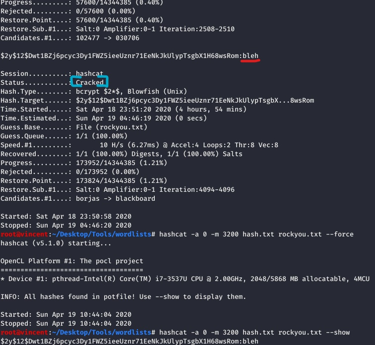
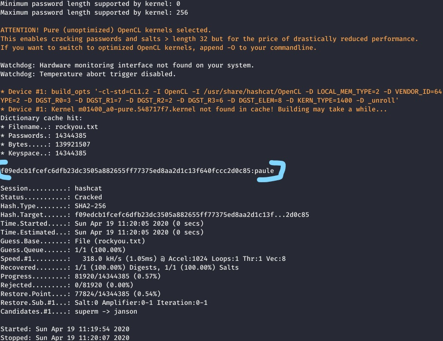
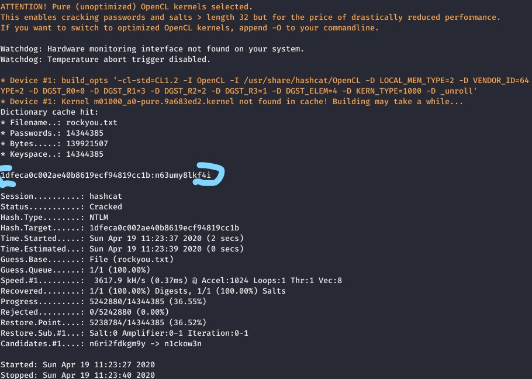
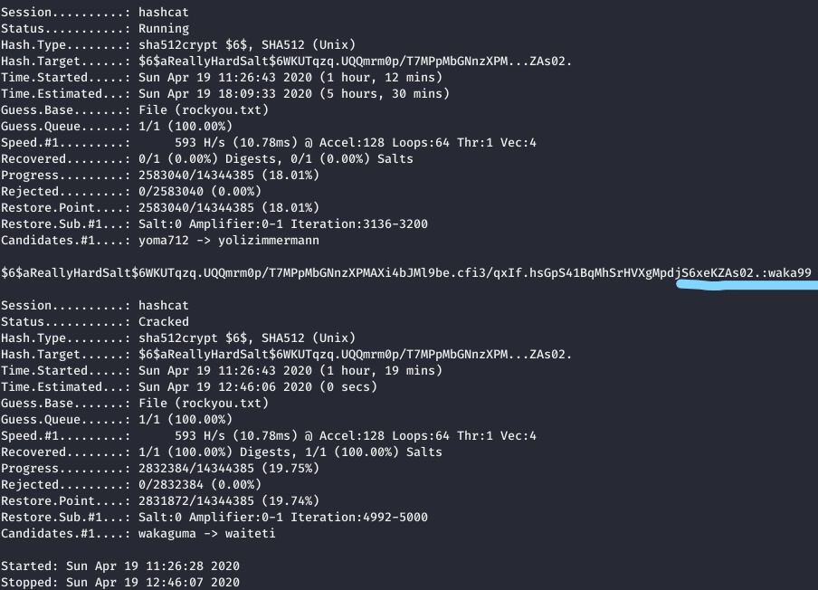
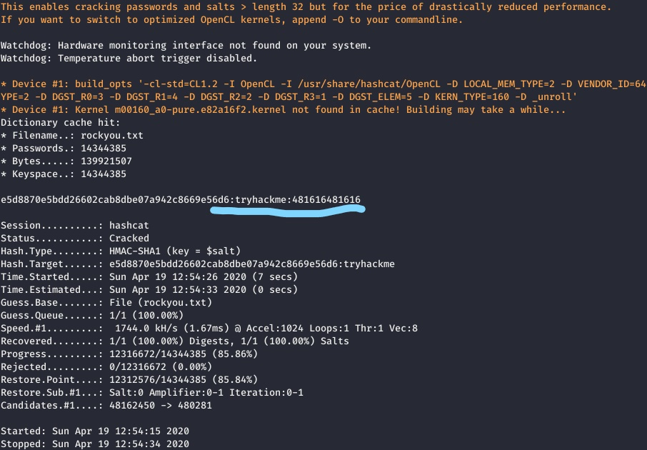

# Crack the Hash CTF write-up
An easy-level [TryHackMe room](https://tryhackme.com/room/crackthehash) which is focusing on **Password Cracking and Hashing Functions**

## Author 
* [Ee En Goh](https://tryhackme.com/p/vincentwu)

## [Task 1] Level 1

For most the quiz in this task, they can be solved in either 
1. [Online Hash Decrypter](https://md5hashing.net/hash)
    * This site enables us to solve the following questions easily, **if and only if those hashes can be found within their database**
    * It has a centralized database that stores large amount of decoded hashes
    * The way it decrypts the given hash is basically *finding the corresponding plain value within the database, with specific hash function*.
    * Note that hashing function is actually a __one-way encryption method__, thus it is hard and time-consuming for decryption in real cases.
    * It also support Google-powered search, to search for the value through Google search engine.
    * Hence, the *value couldn't be found, if those hashes aren't stored within their database*.

2. [Hashcat](https://hashcat.net/hashcat/)
    * It is a *CLI password cracker* that can be used in multiple platforms, which supports decryption on different hash types 
    * Hashcat is able to crack an encryption text in different attack modes, eg. wordlist referencing, brute-force and combination
    * To save times on cracking the following hashes, rockyou.txt is the password dictionary that is recommended to solve all the questions below. 
    * [rockyou.txt](https://github.com/brannondorsey/naive-hashcat/releases/download/data/rockyou.txt) is a list of the most common passwords that previously leaked from certain company, which is used commonly nowadays in hacking.
    * How hashcat cracks the hash is *hashing the __dictionary words/arbitrary characters' combination__ with a certain hashing algorithm, and compare with the target hash*
    * There are tons of different hash types supported, that the [index code](https://hashcat.net/wiki/doku.php?id=example_hashes) of it has to be specified in every cracking, to make the cracking more targetting and less time-consuming
    * Hashcat command example :
        
        ``` Bash
            hashcat -a <attack_mode> -m <hash_type> [path_to_hash_file] [path_to_dict_file]
        ```

        FLAG    | Parameter type | Meaning
        ---     | ---            | ---
        -a <attack_mode> | integer | Select a certain password cracking method, eg. _**0** for wordlist cracking_
        -m <hash_type>   | integer | Select a certain hashing method for target hash cracking, eg. _**0** for MD5 & **100** for SHA-1_

### #1. MD5
#### Hash : 48bb6e862e54f2a795ffc4e541caed4d
#### Hint : MD5
#### Solution : easy

### #2. SHA-1
#### Hash : CBFDAC6008F9CAB4083784CBD1874F76618D2A97
#### Hint : Sha.. but which version
#### Solution : password123

### #3. SHA-256
#### Hash : 1C8BFE8F801D79745C4631D09FFF36C82AA37FC4CCE4FC946683D7B336B63032
#### Hint : Sha..
#### Solution : letmein

### #4. BCrypt 
[BCrypt](https://en.wikipedia.org/wiki/Bcrypt) is a password hashing function based on the [Blowfish cipher](https://en.wikipedia.org/wiki/Blowfish_(cipher))'s key scheduling.

#### Hash : $2y$12$Dwt1BZj6pcyc3Dy1FWZ5ieeUznr71EeNkJkUlypTsgbX1H68wsRom
#### Hint : bcrypt
#### How to solve :
* This question couldn't be solved by only using online resources, which is where the [Hashcat](https://hashcat.net/hashcat/) comes in
* The hash_type code is **3200**, and the full command refers to the format on above
* The result will be looks like the following :

    
    * This is the _result after the given hash is cracked successfully_
    * The red underline text after the original hash is the original plaintext
    * Format : **<original_hash>:<original_text>**
    * The _status value **Cracked**_ means that the given hash got successfully cracked, thus the cracking process will be terminated
    * The resulting format are almost the end for most of the successful cracked results

#### Solution : bleh

### #5. MD4
#### Hash : 279412f945939ba78ce0758d3fd83daa
#### Hint : MD4
#### Solution : Eternity22

## [Task 2] Level 2
* This task increases the difficulty, which most of the hashes here can't be obtained from online tools
* All of the answers will be in the classic [rockyou password list](https://github.com/brannondorsey/naive-hashcat/releases/download/data/rockyou.txt).
* It could be handy to look at some example hashes on [hashcats page](https://hashcat.net/wiki/doku.php?id=example_hashes).

### #1. SHA2-256
#### Hash : F09EDCB1FCEFC6DFB23DC3505A882655FF77375ED8AA2D1C13F640FCCC2D0C85
#### How to find :
* Using the hashcat command as the one on top, except the hash-type code be **-m 1400**
* The result when the cracking is successfully will be look like the following :

    

#### Solution : paule

### #2. NTLM
An password encryption method that developed by Microsoft for their Window services, based on MD4 hashing method.

#### Hash : 1DFECA0C002AE40B8619ECF94819CC1B
#### Hint : NTLM
#### How to find :
* This hash can't be cracked using online tool, since the hashing method is not that prevalent
* Using the hashcat command as the one on top, except the hash-type code be **-m 1000**
* The result when the cracking is successfully will be look like the following :

    

#### Solution : n63umy8lkf4i

### #3. SHA-512, \$6\$ Salted Hash
A [salt](https://en.wikipedia.org/wiki/Salt_(cryptography)) in cryptography is random data that is used as **an additional input to a one-way function that hashes data, a password or passphrase**. It is one of the safeguards developed to protect a user's password against being read from the system. 

In a typical setting, _the salt and the plain password are **concatenated and processed with a hash function**, and the resulting output is stored with the salt within the database_.

#### Hash   : $6$aReallyHardSalt$6WKUTqzq.UQQmrm0p/T7MPpMbGNnzXPMAXi4bJMl9be.cfi3/qxIf.hsGpS41BqMhSrHVXgMpdjS6xeKZAs02.
#### Salt   : aReallyHardSalt (included within the hash)
#### Rounds : 5
#### How to find :
* Using the hashcat command as the one on top, except the hash-type code be **-m 1800**
* The result when the cracking is successfully will be look like the following :

    

#### Solution : waka99

### #4. HMAC-SHA1 (SHA-1 with salted hash)
[Hash-based Message Authentication Code (HMAC)](https://en.wikipedia.org/wiki/HMAC) is a specific type of **message authentication code (MAC) involving a cryptographic hash function and a secret cryptographic key**. It is used to simultaneously verify both the data integrity and the authenticity of a message. 

Any cryptographic hash function could be used in the calculation of an HMAC. For example SHA1, the resulting MAC algorithm is termed HMAC-SHA1 (HMAC-X, where X is the hash function used). 

The cryptographic strength of the HMAC depends on the [cryptographic strength](https://en.wikipedia.org/wiki/Cryptographic_strength) of the underlying hash function, the size of the hash output and, the size and quality of the key

#### Hash : e5d8870e5bdd26602cab8dbe07a942c8669e56d6
#### Salt : tryhackme (not included within the hash) 
#### Hint : HMAC-SHA1
#### How to find :
* This hash can't be cracked using online tool, as the present of salt
* Using the hashcat command as the one on top, except the hash-type code be **-m 160**
* Based on the outfile format of Hashcat, the full target hash should be in :
  ```Bash
    [ Outfile Format ] : hash[:salt] (1)

    hashcat -a 0 -m 160 e5d8870e5bdd26602cab8dbe07a942c8669e56d6:tryhackme </path/to/rockyou.txt>
  ```
* The result when the cracking is successfully will be look like the following :

    

#### Solution : 481616481616