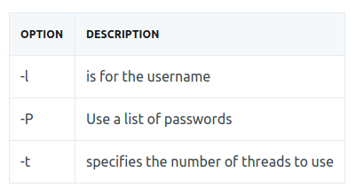
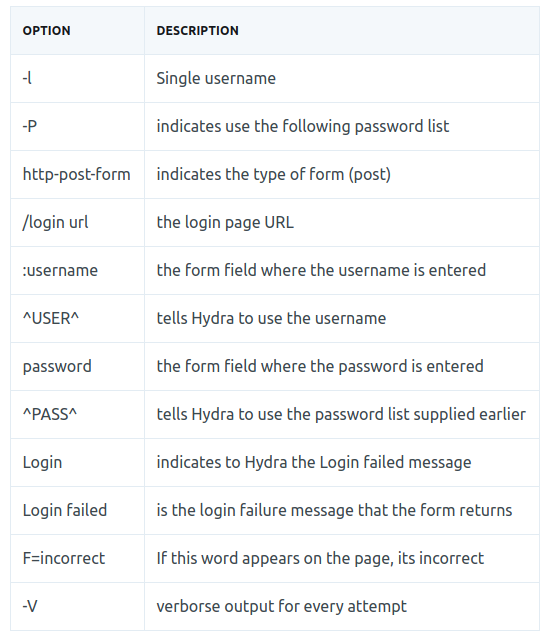

# Hydra

[Hydra](https://github.com/vanhauser-thc/thc-hydra) is a brute-force online password cracking program. It allows us to run through a list and 'bruteforce' some authentication service.

For example the following protocols are crackable with Hydra :
* SSH
* HTTP-FORM-POST
* MYSQL

## Hydra Commands 

```Bash
    hydra [FLAG] server service [OPTIONS]
    man hydra
```

### SSH

```Bash
hydra -l <username> -P <full_path_to_wordlist> <ip> -t <threads> ssh
```



### POST WEB FORM
Hydra can be used to bruteforce web forms too, just make sure what type of requests it is making (ie. GET or POST methods)

For example, HTTP-POST-FORM :

* Static username with wordlists for password
```Bash
hydra -l <username> -P <path_to_wordlist> http-post-form "/<rel_form_url>:username=^USER^&password=^PASS^:F=incorrect" -V
```



* Static password with wordlists for username
```Bash
hydra -L <path_to_wordlist> -p <password> http-post-form "/<rel_form_url>:username=^USER^&password=^PASS^:F=incorrect"
```
OPTION  | DESCRIPTION
---     | ---
-L      | indicates use the following username list
-p      | Single password

## Task Tips 
* Username has been given on the question
* Take [rockyou.txt](https://github.com/brannondorsey/naive-hashcat/releases/download/data/rockyou.txt) as the bruteforce wordlist, which allows you to solve it faster (Something is wrong after 30+ unsuccessful cracks). 
  * For Kali Linux user, it is provided in path _/etc/share/wordlists/rockyou.txt.gz_
