# Mr Robot CTF

A TryHackMe intermediate CTF room, that based on TV show "Mr Robot"

## Tasks

### #0. Recon & Enumeration

1. Find out the subdirectory of the web application, for the lookup efficiency
   * You can use either dirb, dirbuster or gobuster, and I am using gobuster here
   * ```gobuster dir -u 10.10.206.141 -q -w /usr/share/wordlists/dirbuster/directory-list-2.3-medium.txt```

        Option          | Description
        ---             | ---
        -q              | Quiet mode, which only output subdirectories found
        -u *URL*        | target URL
        -w *WORDLIST*   | Wordlist used for subdirectory searching

2. Check services available of this web application with Nmap
  
    ```Bash
    nmap -A -T4 <URL>
    ```

      Option  | Description
      ---     | ---
      -A      | Enable OS detection, version detection, script scanning, and traceroute
      -T(0-5) | Set timing template (higher is faster)

3. One of the we app subdirectories give you a **wordlist** that is useful in the later stage
   * Look into that wordlist and you will see it is large but containing a lot of dupicate entries
   * It can be removed by using the following command and save it to a new dictionary file

    ```Bash
      sort <original_dic_file> | uniq > <new_dic_file>
    ```

    * ```sort``` command is used to arrange the dictionary words in alphabetic order
    * ```uniq``` command is used to omit repeated entries

### #1. Key 1

* Hint  : Robots
* Solve :
  * For a website / web application, the first thing in mind with hint **__robots__** is definitely the text file *robots.txt*
  * [robots.txt](https://moz.com/learn/seo/robotstxt) is a text file webmasters create to instruct web robots (typically search engine robots) how to crawl pages on their website
  * In practice, it indicates whether certain user agents (web-crawling software) can or cannot crawl parts of a website.
  * These crawl instructions are specified by **“disallowing”** or **“allowing”** the behavior of certain (or all) user agents.
  * However, since *neither crawl instructions aren't used*in this case, thus it is just used as a general text file
  
    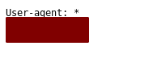

  * The key is stored on one of the listed path/file
* Reference :
  * <https://moz.com/learn/seo/robotstxt>

### #2. Key 2

* Hint  : White coloured font
* Solve :
  * View raw request package
    * BurpSuite
      * An interception proxy that allows to intercept and view the raw request before sent by the browser client
      * Setup & instructions can be found [here](https://portswigger.net/support/getting-started-with-burp-proxy)

        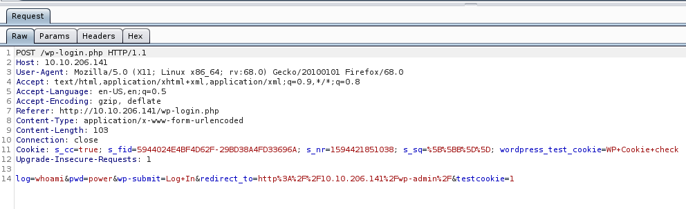

    * Browser inspector mode
      * Check out the inspector mode of your browser with shortkey CTRL + SHIFT + C (Firefox)
      * Navigate to ***Network*** tab
      * Send an arbitrary credential to login
      * Check out the **POST** request and click on the "**Edit and Resend**" button

        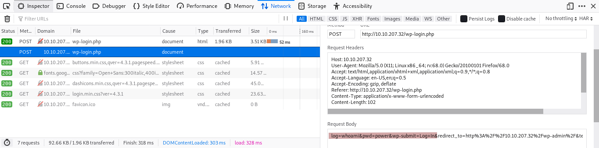

  * Brute-force login-form (./login)
    * WPscan
      * ```wpscan --url http://10.10.206.141 -t 50 -U elliot -P ~/Desktop/TryHackMe/Mr.RobotCTF/src/fsociety_sorted_unique.txt```
    * Hydra (Other than WPscan)
      * ```hydra -f -V -l elliot -P ~/Desktop/TryHackMe/Mr.RobotCTF/src/fsociety_sorted_unique.txt -t 4 10.10.94.175 http-post-form "/wp-login.php:log=^USER^&pwd=^PASS^&wp-submit=Log In&testcookie=1:F=ERROR"```
  * There are several ways to obtain a reverse shell on WordPress version 4.3.1, one of them is inject malicious code to *WordPress theme*
  * Before activate a reverse shell, it is essential to know the IP address of your machine and start the port listener
    * Machine's IP address (tun0, a common VPN interface name, as I am using OpenVPN)

      ```Bash
        ifconfig tun0   # Linux
      ```

      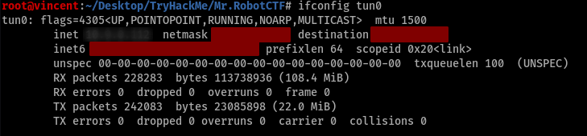

    * Activate netcat port listener

      ```Bash
        nc -nlvp <PORT_NUMBER>
      ```

      Option    | Description
      ---       | ---
      -n        | Numeric-only IP addresses, no DNS
      -l        | Listen mode, for inbound connects
      -v        | Verbose mode, which output more often when certain events happen
      -p *PORT* | Local port number to work on

      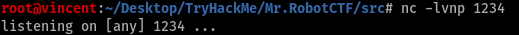

  * Reverse shell exploitation code in PHP can be found on path ```/usr/share/webshell/php``` on Kali, else can be found from original [link](http://pentestmonkey.net/tools/php-reverse-shell)
  * After modify the IP address variable to that of the machine to access the reverse shell, copy that to replace the source code of 404 page template

    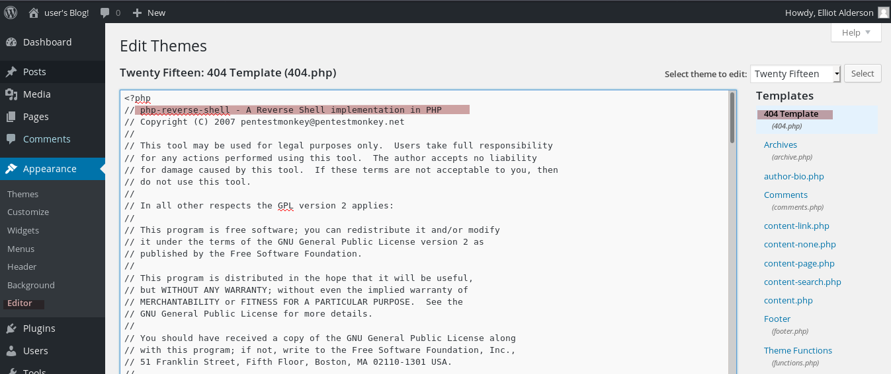

  * Then, access an arbitrary invalid page for the 404 page returned, and activate the reverse shell in order

    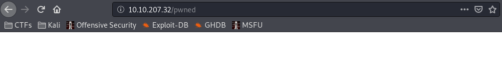

  * Check the output of netcat to ensure the reverse shell is working

    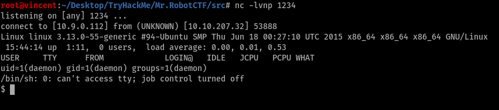

  * We can enhance the reverse shell, like normal local shell by using the following python command/script :

    ```Python
      python -c 'import pty ; pty.spawn("/bin/bash")'
    ```

    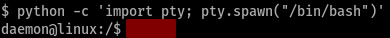

  * After traverse around the web server, we found the file containing the 2nd flag in ```/home/robot``` directory

    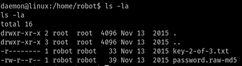
  
  * Since we aren't the file owner, thus it is clear that we have insufficient permission to read the text file. However, there is another file saved as **.raw-md5** extension, hence we can assume that it is a raw [MD5](https://en.wikipedia.org/wiki/MD5) hash generated from the user robot's password
  * Regarding the 'unhashing' method, I personally prefer using *online hashing database* to find the corresponding plaintext, in terms of efficiency since those hash entries have been cracked beforehand

    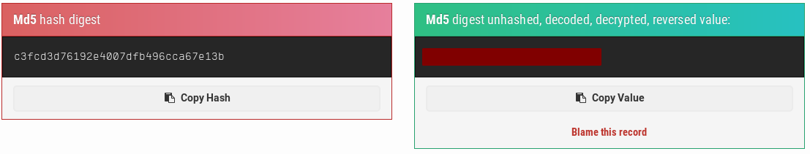

  * It also can be cracked by using [hashcat](https://hashcat.net/hashcat/), when the target hash isn't recorded in the database

    ```Bash
    hashcat -a 0 -m 0 <hash_file> <wordlist> --force
    ```

    Option            | Description
    ---               | ---
    -a *ATTACK_MODE*  | Select attack mode (0-7), 0 means **Straight/Dictionary Attacks**
    -m *HASH_TYPE*    | Select the hashing algorithm on this hash
    --force           | Ignore warnings

    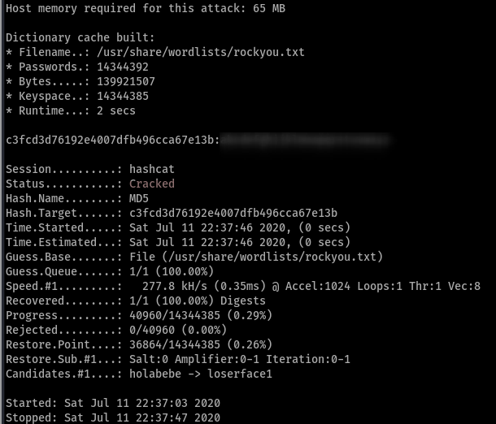

  * Note : recommend using [rockyou.txt](https://github.com/brannondorsey/naive-hashcat/releases/download/data/rockyou.txt) as the cracking wordlist, which can also found in path ```/usr/share/wordlists/rockyou.txt```
  * We can login with user account **robot**, by using command ```su <account>``` and key in the password found

    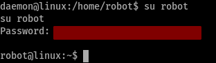
  * You should be able to read the text file with the 2nd flag till this stage

* Reference :
  * <https://www.hackingarticles.in/comprehensive-guide-on-hydra-a-brute-forcing-tool/>
  * <https://blog.wpscan.org/wpscan/2019/09/17/wpscan-brute-force.html>
  * <https://www.cvedetails.com/vulnerability-list/vendor_id-2337/product_id-4096/version_id-224373/Wordpress-Wordpress-4.3.1.html>
  * <https://www.hackingarticles.in/wordpress-reverse-shell/>
  * <https://www.exploit-db.com/exploits/36374>
  * <https://md5hashing.net/>

### #3. Key 3

* Hint : nmap
* Solve :
  * The priority is to get the root access of this web server, which we call *Linux Privilege Escalation*
  * **SUID (Set User ID)** is a type of permission which is given to a file and allows users to execute the file with the permissions of its owner
  * There are certain file that run with *root permission* and *set true of the SUID flag*, which can be the break-in point in this case
  * They can be found with command :

    ```Bash
      find / -perm -u=s -type f 2>/dev/null
    ```
  
    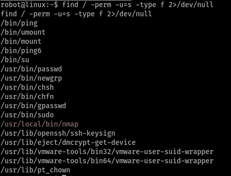
  
  * Worth to notice that nmap is included and it has an interactive mode enabled in older version [(2.02 - 5.21)](https://gtfobins.github.io/gtfobins/nmap/)
  * By enabling the interactive mode, we get the root access without login password successfully !

    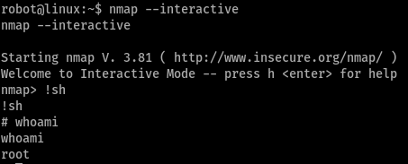
  
  * Now we can access ```/root``` and the flag is found

    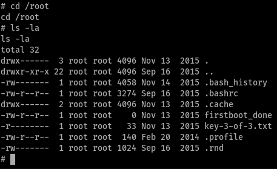

* Reference :
  * [Linux SUID executable](https://pentestlab.blog/2017/09/25/suid-executables/)
