# [OWASP Top 10](https://tryhackme.com/room/owasptop10)

A TryHackMe walkthrough room to allow users to learn one of the OWASP vulnerabilities every day for 10 days in a row.

**OWASP** = Open Web Application Security Project

[OWASP Top 10](https://owasp.org/www-project-top-ten/) is _10 of the most critical vulnerabilities_, selected from a regularly-updated report outlining security concerns for _web application security_

## [Day 1] Injection

### Intro to Injection

- Injection flaws occur because **_user controlled input is interpreted as actual commands or parameters by the application_**.
- This attack depends on what technologies are being used and how exactly the input is interpreted by these technologies
- Possible Outcomes :
  - _Access, Modify and Delete information in a database_ when the maliciously designed input is passed into database queries (eg. SQL Injection)
  - _Execute Arbitrary system commands_ on a server that would allow an attacker to gain access to user's systems (eg. OS Command Injection)
- The main defense to prevent injection attacks is ensuring that _user controlled input is not interpreted as queries or commands_, such as
  - Using an **allow list**, input other than those safe input or characters is rejected
  - Stripping input, by _removing or sanitize those dangerous characters_ before they are processed
- Dangerous characters / input is classified as _any input that can change how the underlying data is processed_

### Command Injection Practical

Same as [TryHackMe](https://tryhackme.com/room/injection) Injection [room](https://github.com/GohEeEn/TryHackMe-Write-Up/tree/master/Injection#task-3-active-command-injection)

## [Day 2] Broken Authentication

### Intro of Broken Authentication

- Authentication and session management constitute core components of modern web applications
- **Authentication** allows users to _gain access to web applications by verifying their identities_, and the most common form will be **_username-password pair_** mechanism
- If the _server accepts the given credentials_, it will provide the user's browser with a **session cookie**, as web servers use _HTTP(S)_ which is stateless to communciate, in order to know the sender and track the user's actions
- Common flaws in authentication mechanisms :
  - **Brute-force attacks**
  - **Weak Credentials** : Strong password policies are required, ie. no common password and versatile password rules
  - **Weak Session Cookies** : _No predictable values on session cookies_, else they can customize and access user's accounts without knowing the account password
- Mitigation available :
  - **_Strong password policy_** on application, to prevent password guessing attack
  - **_Automatic lockout_** after a _certain number of login attempts_, that can prevent _brute-force attack_
  - **_Multi Factor Authentiction_**, that require more than one methods of authentication, like require mobile code beside username-password credential

### Broken Authentication Practical

`Re-registration of an existing user (implementation error)`

- They are simple tasks, just follow the walkthrough instructions to complete them
- We can see that this authentication system treats username "x" and " x" differently in account registration, but not the case in login part
- Possible cause could be _different sanitization method used in registration and login mechanism_ (whitespace removed to check for existing, same username), which is critical

## [Day 3] Sensitive Data Exposure

### Intro to SDE

- _Insufficient protection on sensitive data_ such as personal or/and financial data, that leads to attacker's access and sellor utilize it for nefarious purposes, eg.
- [Man-in-the-Middleattack (MitM)](https://www.cloudflare.com/learning/security/threats/man-in-the-middle-attack/) is one of the most common technique, whereby the atacker forces user connections through a controlled intermediate device, then take advantage of weak encryption on transmitted data to gain access to the intercepted information
- The exposure risk can be **minimized** by
  - Encrypting all sensitive data
  - Disabling the caching (stored temp data for reuse) of any sensitive data
  - Avoid storing unnecessary sensitive data
- The _most common way to store a large amount of data in a format that is easily accessible from many locations at once_ is in a **database**, which is perfect for web application
- Database engines usuall follow the _Structured Query Language (SQL) syntax_, although alternatives such as NoSQL are rising in popularity
- There are several way to setup a databases, like on dedicated servers with database service running (eg. MySQL / MariDB) or _stored as files_ ("**flat-file**" databases)
- About flat-file databases :

  - Stored as a file on the disk of a computer
  - Easier setup than a full database server
  - Normally found in smaller web application
  - The risk isn't on file itself, but _the disk location of where the file stored_ (eg. /root), that could allows user to get certain privilege on the host machine
  - The most common and simplest format of flat-file database is an [sqlite](https://en.wikipedia.org/wiki/SQLite) database, that can _interact in most programming languages_, and having a dedicated client (sqlite3) for querying them on the CLI
  - Command `sqlite3 <database-name>` is used to access the sqlite database file
  - Some sqlite client CLI queries :

    | Query                                                                                 | Description                                                       |
    | ------------------------------------------------------------------------------------- | ----------------------------------------------------------------- |
    | [PRAGMA table_info(table_name)](https://www.sqlite.org/pragma.html#pragma_table_info) | Output table information, such as column name and their data type |
    | SELECT \* FROM table_name                                                             | Return all data entries in the database                           |

### Sensitive Data Exposure Challenge (Hints)

1. Look into the web application source code for each directory/page, which can be done by `Ctrl + u` (Firefox). You need to find the name of a certain hidden directory in a code comment
2. It is a SQLite file, check the file extension
3. Using commands in walkthrough to find a DB entry with username **admin**
4. Online password cracking site given in the walkthrough is efficient

## [Day 4] XML External Entity (XXE)

### Intro to XXE

- A vulnerability that abuses features of **XML parsers/data**, that often allows an attacker to _interact with any backend or external systems that application itself can access_ and can allow the attacker to read the file on that system
- It could cause the following serious attacks :
  - [Denial of Service (DoS)](https://en.wikipedia.org/wiki/Denial-of-service_attack) attack
  - [Server-Side Request Forgery (SSRF)](https://en.wikipedia.org/wiki/Server-side_request_forgery) to make requests to other applications in name of that vulnerable app
  - [Remote Code Execution (RCE)](https://www.netsparker.com/blog/web-security/remote-code-evaluation-execution/) by enable port scanning
- Different (2) types of XXE attacks :
  - **In-band** XXE, which the attacker can _receive an immediate response_ to the XXE payload
  - **Out-of-band** (OOB) XXE, which has _no immedite response from the web application_ and attacker has to reflect the output of their XXE payload to some other file or their own server

### Intro to XML


- XML (eXtensible Markup Language) is a markup language that defines a set of rules for encoding documents in a format that is both human-machine readable
- Used for storing and transporting data
- _Extensible_, which means the data stored and transported using XML can be changed in any time _without affecting the data presentation_
- _Validation using DTD and Schema_, which ensures that the XML document is free from any syntax error
- Simply data sharing between various systems because of its platform-independent nature
- _No conversion required_ to transfer between different systems
- _Case sensitive_ in term of tag syntax, eg. <\tag> and <\Tag> are different in XML

### Intro to XML DTD

- DTD stands for _Document Type Definition_, which defines the structure and the legal elements and legal elements and attributes of an XML document
- File extension : `.dtd`
- XML DTD example :

  ```XML
  <!DOCTYPE note [                          <!-- <note>     : root element-->
    <!ELEMENT note (to,from,heading,body)>  <!-- <note>     : element in type '#PCDATA' -->
    <!ELEMENT to (#PCDATA)>                 <!-- <to>       : element in type '#PCDATA' -->
    <!ELEMENT from (#PCDATA)>               <!-- <from>     : element in type '#PCDATA' -->
    <!ELEMENT heading (#PCDATA)>            <!-- <heading>  : element in type '#PCDATA' -->
    <!ELEMENT body (#PCDATA)>               <!-- <body>     : element in type '#PCDATA' -->
    <!ENTITY writer "Donald Duck">          <!-- &writer;   : Internal entity 'writer' with interpreted value "Donald Duck" -->
    <!ENTITY copyright SYSTEM "https://www.w3schools.com/entities.dtd">
    <!-- &copyright; : External  entity 'copyright' with interpreted value that can be found on remote DTD -->
  ]>

  ```

  - **Reference** : <https://www.w3schools.com/xml/xml_dtd_entities.asp>
  - **Note** : _[#PCDATA](https://en.wikipedia.org/wiki/PCDATA)_ means parseable character data

### Intro to XXE Payload

1. Read system file `/etc/passwd` with external ENTITY (FTP URL syntax)

   ```dtd
   <!DOCTYPE root [
     <!ENTITY read SYSTEM 'file:///etc/passwd'>
   ]>

   <root>&read;</root>
   ```

   - It displays the file content if a website is vulnerable to XXE

### XXE Practice

1. Try to display your own name using any payload

   ```xml
   <!DOCTYPE name [
     <!ENTITY firstname 'FIRSTNAME_STRING'>
     <!ENTITY lasttname 'LASTNAME_STRING'>
   ]>

   <name>
     <tag1>&firstname;</tag1>
     <tag2> &lastname;</tag2>
   </name>
   ```

2. See if you can read the /etc/passwd

   ```xml
   <!DOCTYPE any
     [<!ENTITY passwd SYSTEM 'file///etc/passwd'>]
   >

   <any>
     <pass>&passwd;</pass>
   </any>
   ```

3. What is the name of the user in /etc/passwd ?

   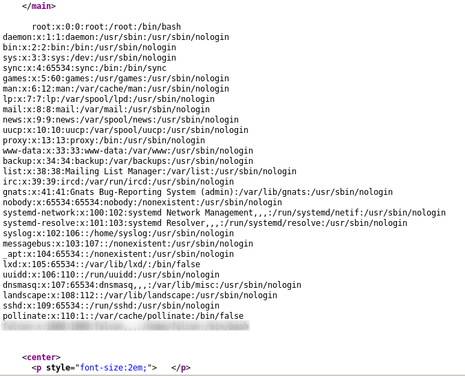

4. Payload used :

   ```xml
   <!DOCTYPE any
     [<!ENTITY passwd SYSTEM 'file///home/falcon/.ssh/FILE_NAME'>]
   >

   <any>
     <pass>&passwd;</pass>
   </any>
   ```

5. What are the first 18 characters for falcon's private key ?

   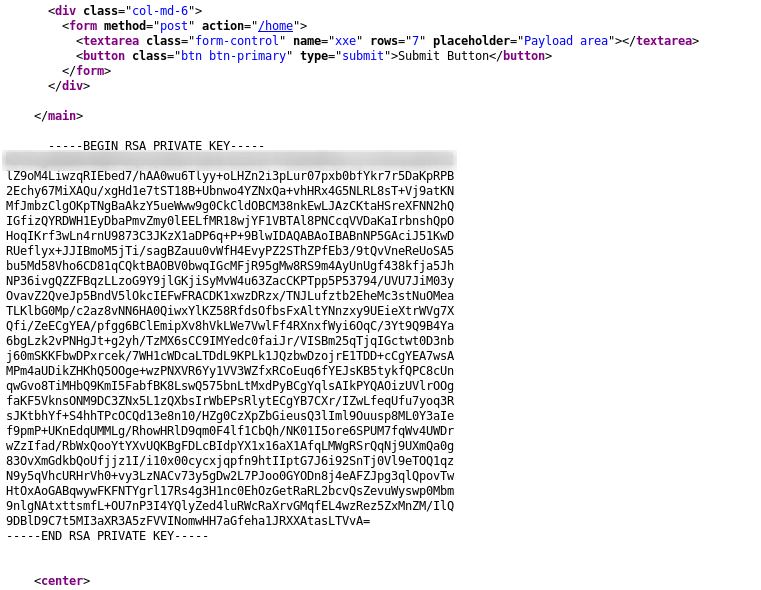

6. Reference : <https://www.digitalocean.com/community/tutorials/how-to-configure-ssh-key-based-authentication-on-a-linux-server>

## [Day 5] Broken Access Control

### Intro to Broken Access Control

- **Access control/Authorization** is the process where _requests to access a particular resource that should be granted or denied_
- It is different from **authentication**, which is _providing and validating identity_, but including the _execution rules that determine which functionality and data the user may access, ensuring the proper allocation of access rights after authentication is successful_
- Most websites have pages that are prohibited from regular visitors/users, but only authorized users like admin are able to access those pages
- If a _website visitor is able to access those protected page(s) that they are not authorised to view_, then the _access controls are broken_
- Possible causes :
  - Lack of automated detection
  - Lack of effective functional testing
- Possible outcomes :
  - Able to view sensitive information
  - Accessing unauthorized functionality amd impacting in term of business
- More references :
  - <https://owasp.org/www-project-top-ten/OWASP_Top_Ten_2017/Top_10-2017_A5-Broken_Access_Control>
  - <https://cheatsheetseries.owasp.org/cheatsheets/Access_Control_Cheat_Sheet.html>

### Intro to IDOR

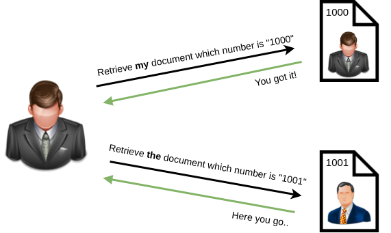

- IDOR stands for **_Insecure Direct Object Reference_**, which is the act of exploiting a _misconfiguration in the way user input is handled_, to access resources you wouldn't be able to success normally
- For image example :
  - A user has the authentication to login and retrieve document with number "1000", with URL like <https://example.com/bank?account_number=1000>
  - He can also get _other document with number "1001" that he is not authorized to_, by changing the parameter value (ie. account_number=1001)
- Reference
  - <https://portswigger.net/web-security/access-control/idor>
  - <https://www.bugcrowd.com/blog/how-to-find-idor-insecure-direct-object-reference-vulnerabilities-for-large-bounty-rewards/>

## [Day 6] Security Misconfiguration

- It is distinct from other Top 10 vulnerabilities, since they occur when security should have ben configured properly but it wasn't
- Some example of security misconfigurations :
  - Default accounts with unchanged passwords
  - Unnecessary features enabled, like services, pages, accounts or privileges
  - Poorly configured permissions on cloud services
  - Error messages that are overly detailed and allow an attacker to find out more about the system
  - Not using [HTTP security headers](https://owasp.org/www-project-secure-headers/), that leads to revealing too much details about the server
- Those vulnerabilities often lead to more vulnerabilities, such as default credentials, XXE or command injection on admin-only pages
- References :
  - <https://owasp.org/www-project-top-ten/OWASP_Top_Ten_2017/Top_10-2017_A6-Security_Misconfiguration>
  - <https://www.freecodecamp.org/learn/information-security/information-security-with-helmetjs/>

### Security Misconfiguration Practice : Default Passwords

- Default passwords of certain service accounts and products are often the same as other same services and products
- Every default passwords should be changed once it is available, else any other user who knows the default password can access those services and products you own
- As it is common on IoT devices, that could allow attackers to own your devices with admin privilege

1. Access the vulnerable web application, Pensive Notes
   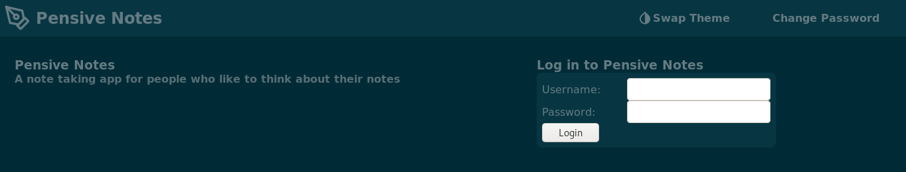

2. Find out if there is any hidden subdirectory with [dirsearch](https://github.com/maurosoria/dirsearch)
   

   ```bash
   /path/to/dirsearch.py -u <URL> -w </PATH/TO/WORDLIST> -E
   # Option -E means any file extension
   ```

3. Seems nope, then view the web app source code (Ctrl + u) and same result.

4. Hint given to find the source code documentation, which has to be some online VCS like GitHub
   

5. Login the web app with default credential found on GitHub and you can find the flag !
   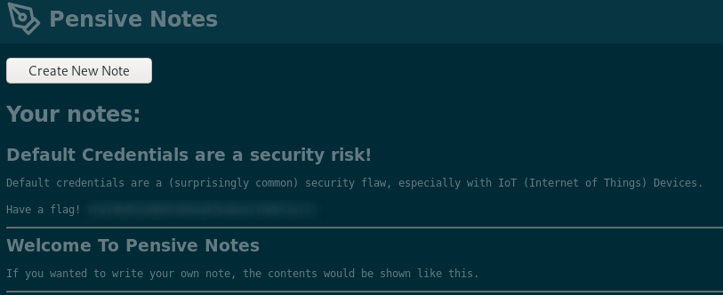

## [Day 7] Cross-site Scripting (XSS)

### Intro to XSS

- A security vulnerability typically found in web applications, especially if it uses **_unsanitized user input_**
- It is a type of _injection attack that allow an attacker to execute malicious scripts_ and have it execute on victim's machine
- 3 main types of XSS :
  XSS | Description
  ---- | ----
  Stored XSS | The most dangerous type of XSS, where a **_malicious payload originates from the website's database_**. Often happens when a website _allows unsanitized user input to store into the database_
  Reflected XSS | The malicious payload is part of the victims _request to the website_, that returned as a **response** (also the malicious action). It _requires the victim to click on the designated URL in order to execute the malicious payload_ (since users normally won't input those payload)
  DOM-Based XSS | Document Object Model (DOM) is a programming interface for HTML & XML documents. It represents the page so that progrms can change the document structure, style and content
- References :
  - [XSS Payloads](http://www.xss-payloads.com/)
  - [Burp Suite Web Security Academy : XSS](https://portswigger.net/web-security/cross-site-scripting)

### XSS Practices

- **Note** : Given URL is not directed to destination page, recommend to access the page with given IP address then navigate to page vulnerable to certain type of XSS
- Available payloads :

  ```javascript
    <script>alert("STRING")</script>                    // display alertbox with given string
    <script>alert(window.location.hostname)</script>    // display alertbox with your machine IP
    <script>alert(document.cookie)</script>             // display alertbox with all document cookies available

    // payload to write/replace text on element with given ID
    <script>document.querySelector(element_id).textContent = "textContent"</script>
  ```

  **Q2 - 3**

  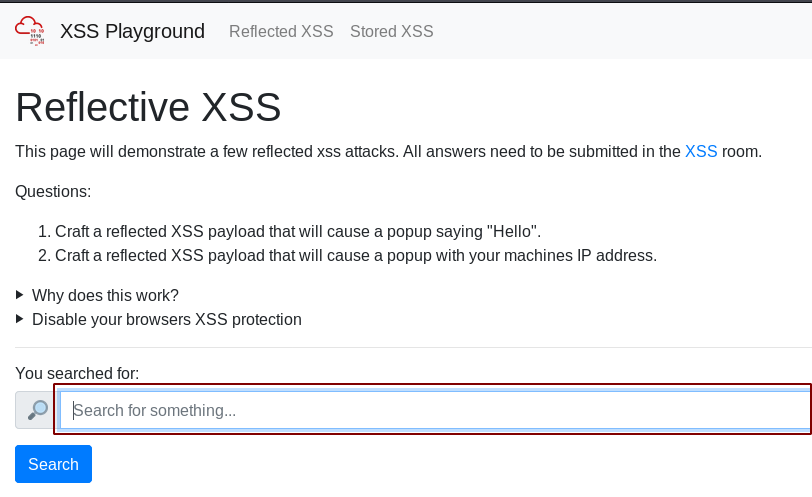
  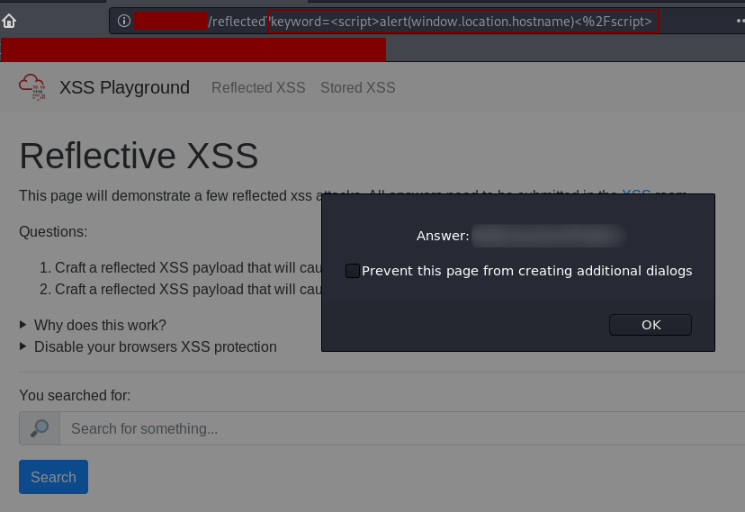

  **Q4 - 6**
  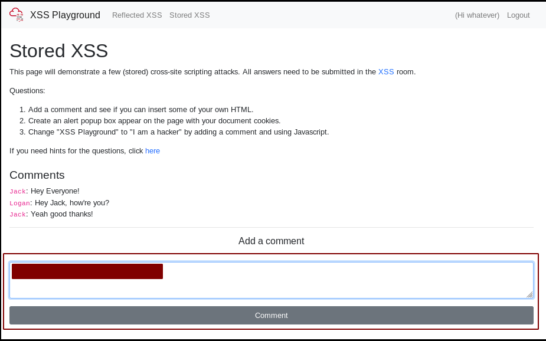
  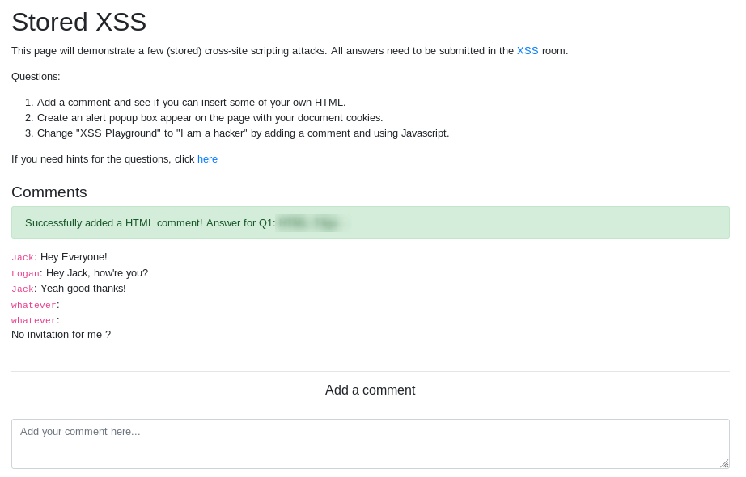
  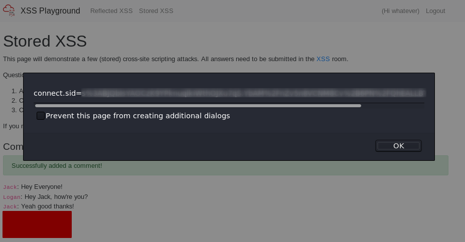
  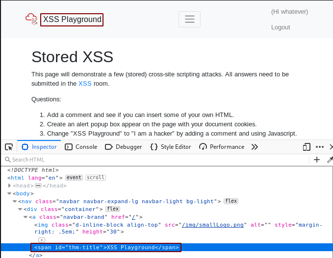
  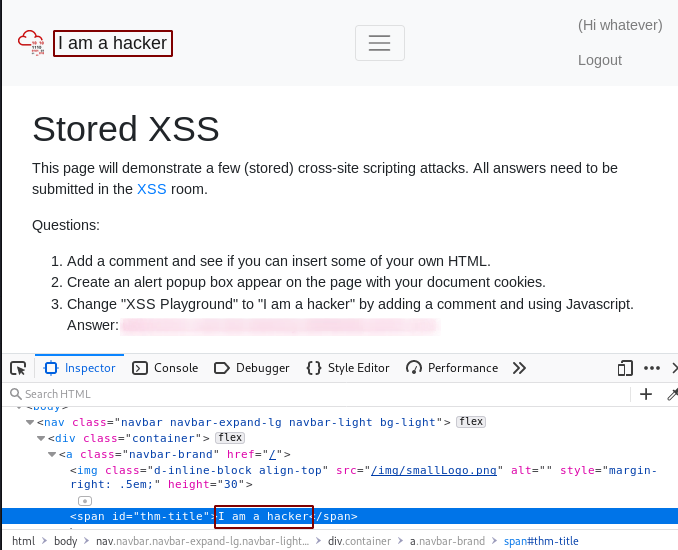

- References :
  - <https://developer.mozilla.org/en-US/docs/Web/API/Document/cookie>

## [Day 8] Insecure Deserialization

### Intro to Serialization

- **Serialization** is the _process of converting complex data structures_, such as objects and their fields, _into a "flatter" format that can be sent and received as a sequential stream of bytes_
- Serializating data akes it much simpler to :
  - Write complex data to inter-process memory, a file or a database
  - Send complex data in a lighter way to the destination, like over the network, different components of an app or an API call
- When serializing an object, its state is also persisted, which means _its attributes and assigned values are preserved_

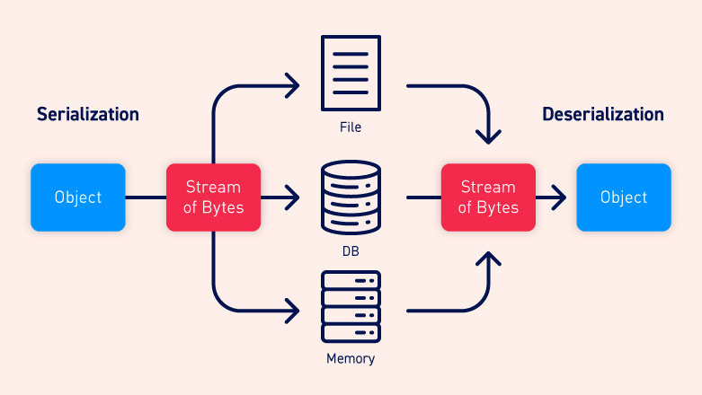

### Intro to Deserialization

- **Deserialization** is the process of _restoring this byte stream to a fully functional replica of the original object, in the exact state as when it was serialized_
- The website's logic can then interact with this deserialized object, just like it does to any other object
- Many programming languages like Ruby, Python and Java offer native support for serialization, while how objects are serialized depends on the language
- Serialization can be done by converting the object into _binary or string formats_
- The terms used for serialization can be different by language, like **Ruby** has _marshalling_ and **Python** has _pickling_

### Intro to Insecure Deserialization

- **Insecure deserialization** is when _user-controllable data is deserialized by a website_, which potentially _enables an attacker to manipulate serialized objects in order to pass harmful data into the application code_
- OWASP rank this vulnerability as 8 out of 10 for the following reasons :
  - **Low exploitability**, which it is often a case-by-case basis, that there is no reliable tool/framework for it. Thus, the attackers need to have a good understanding of the inner-workings of the ToE (Task, Object, Event)
  - It is only dangerous if attacker's skill permits, more so, the value of the data exposed vary
- Ultimately, _any application that stores or fetches data where there are **no validations or integrity checks in place for the data queried or retained**_, example :
  - E-Commerce Sites
  - Forums
  - API
  - Application Runtimes (Tomcat, Jenkins, JBoss, etc)

### Intro to Cookies

- **Cookies** are an essential tool for modern websites to function, which it _stores data created by a website on the user's computer_
- It is used by e-commerce sites to store user-specific behaviours like items in their shopping cart or session IDs
- It is _not permanent storage solutions_ like database, but depending on either when the browser is closed, or the "Expiry" timer that is set when the cookie is created, by the **browser**
- Some of the common cookies attributes :

  | Attribute    | Description                                                          | Required? |
  | ------------ | -------------------------------------------------------------------- | --------- |
  | Cookie Name  | The Name of the Cookie to be set                                     | Yes       |
  | Cookie Value | The assigned value that can be either in plaintext or encoded        | Yes       |
  | Secure Only  | This cookie will only be set over HTTPS connections if it is enabled | No        |
  | Expiry       | Set a timestamp of when the cookies will be removed from the browser | No        |
  | Path         | The cookie will only sent if the specified URL is within the request | No        |

## [Day 9] Components with Known Vulnerabilities

### Intro to Components with Known Vulnerabilities

- There are several **exploitation databases** online that record the known vulnerabilities from individual products and services, like [exploit-db](https://www.exploit-db.com/) and [AttackerKB](https://attackerkb.com/), that are used to raise the security awareness of users and developers
- They can be used by companies to pentesting their products, in order to find out the potential flaw before their products get public and attacked
- However, those well-maintained and documented databases can also be used to _launch attack toward those known vulnerable services and products_
- OWASP rates a **high score** (3 out of 9, _the lesser the easier to conduct_) **_prevalence scale_**, since it is incredibly easy for a company to miss an update for an application, while requires very little work on the part of the attacker
- Reference :
  - [How OWASP rates the vulnerabilities](https://owasp.org/www-community/OWASP_Risk_Rating_Methodology)

### Exploiting components with known vulnerabilities (Practical)

First thing to do to exploit a web application is to recon the information about it, eg. what kind of platform is used to built this web application

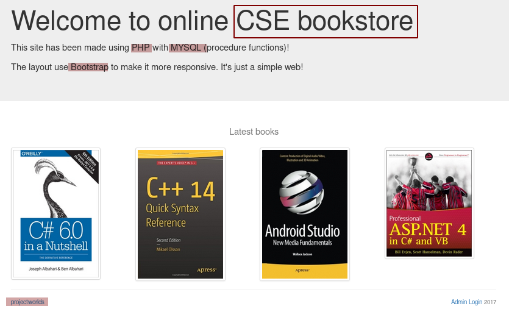

Seems like it is developed with [projectworlds](https://projectworlds.in/). Also, based on the given hint "check for recent unauthenticated bookstore app rce's", I did the following search query :

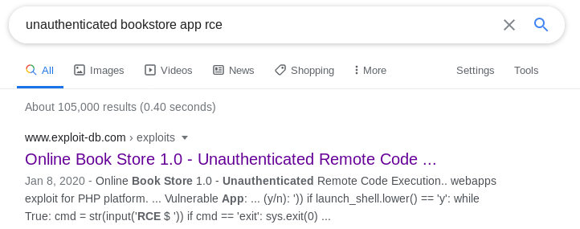

This is the target exploit documentation we are looking for :

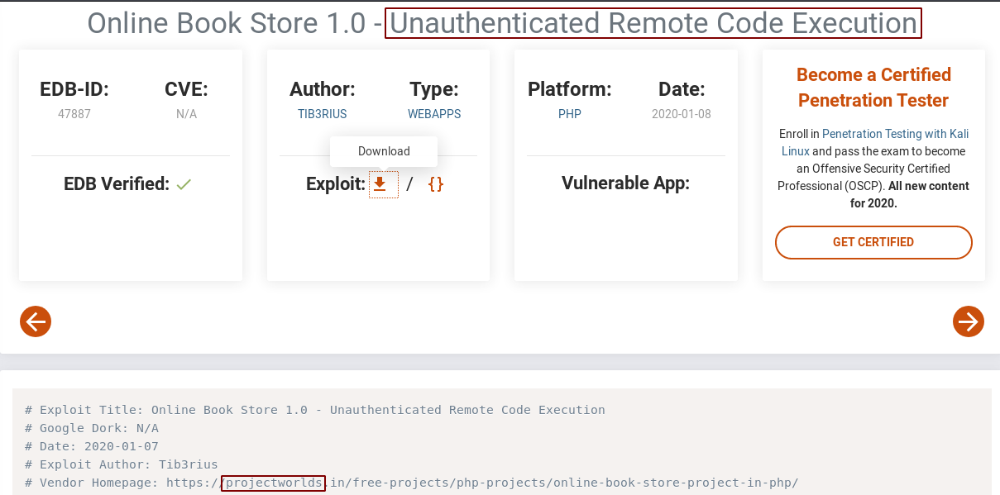

Download the exploit and launch it with URL in the correct format (<http://IP_ADDR>), else error will be returned and reverse shell failed

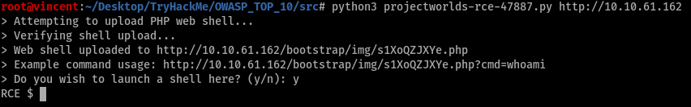

Finally you can just execute the given command `wc -c /etc/passwd` to find out the number of characters in file `/etc/passwd`

#### Recon Bonus

Previously I mention I was using the wrong URL format for executing the exploitation, and I have done further recon about this web application. What have I done first is to brute-force application subdirectories to find out hidden path with [dirsearch](https://github.com/maurosoria/dirsearch)

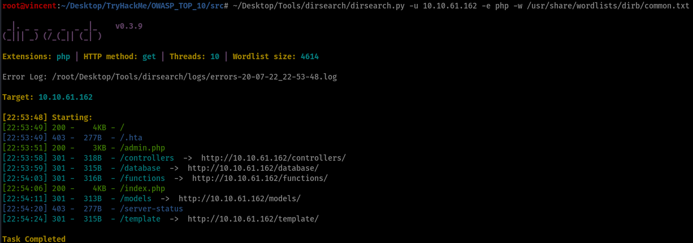

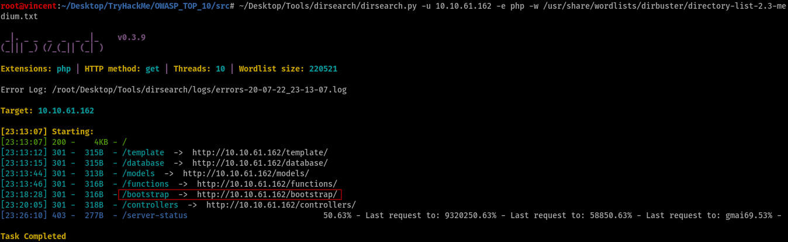

After several checking and I got a SQL database file from path `/database` with hardcoded admin account credential, that will allows you to login with admin account and find out how this exploitation is done

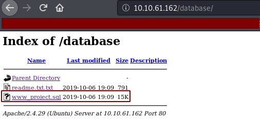

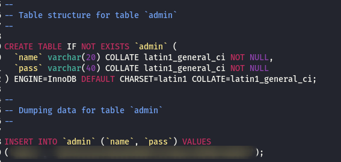

From the exploitation source code, we can see

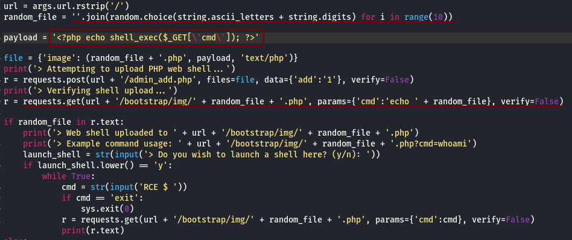

The payload is a piece of PHP code that used to establish a reverse shell / RCE (remote code execution). The `random_file` variable is used to generate a random name for the exploitation to upload to the web app database, through the way admin adds an image of a new book on page `url/admin_add.php`, which it will be stored on path `url/bootstrap/img` and the exploitation will be stored and named as `url/bootstrap/img/random_file.php`.

Here are the exploitation files found on path `url/bootstrap/img/`

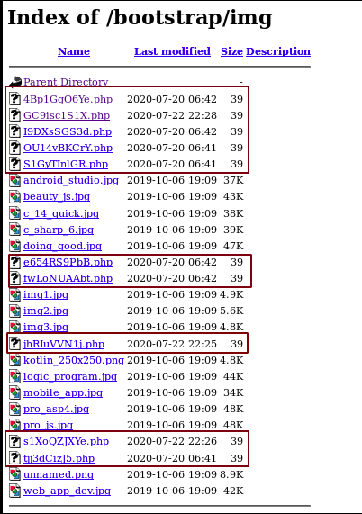

## [Day 10] Insufficient Logging and Monitoring

- When web applications are setup, every action performed by the user should be logged
- Logging is important because in the event of an incident, the attackers actions can be traced
- Once their actions are traced, their risk and impact can be determined, vice versa
- Impacts can be done :
  - **Regulatory Damage** : The application owner needs to take responsibility when there's a data breach while no record of it
  - **Risk of further attack** : Undetected presence of an attacker allows them to launch further attacks against the web application
- The information stored in logs should include :
  - HTTP status codes
  - Time Stamps
  - Usernames
  - API endpoints/page locations
  - IP addresses
- These logs do have some sensitive information on them so it is important to _ensure they are stored securely and multiple copies of these logs are stored at different locations_
- Logging is more important after a breach or incident has occurred and the ideal case is having monitoring inplace to detect any suspicious activity, to either stop the attacker completely or reduce the impact they've made if their presence has been detected much later than anticipated
- Common example of suspicious activity includes :
  - Multiple unauthorized attempts for a particular action
  - Requests from anomalous IP addresses or locations
  - Use of automated tools, that can be determined by the value of User-Agent headers or the request speed
  - Common payloads
- The suspicious activity needs to be rated according to the impact level, rather than only. The higher the rating then the sooner the responds need to be done, like raises the attention of the relevant party

### Practical : Analyse a log

From the log, assume all the requests with [HTTP response status code](https://developer.mozilla.org/en-US/docs/Web/HTTP/Status) 200 (meaning **OK**) are the successful login requests (destination : **/login**), we only need to pay attention on those with 401 (Unauthroized), which means login attempt **fail**

Since there is a consequential failed attempt, we can assume those are made by attackers, trying to login the web application with random username/credential

Thus, the IP address the attacker is using will be **49.99.13.16**, with an automated [**brute force**](https://www.google.com/url?sa=t&rct=j&q=&esrc=s&source=web&cd=&cad=rja&uact=8&ved=2ahUKEwixu7OIruTqAhVqThUIHYgeBvgQFjAAegQIARAB&url=https%3A%2F%2Fen.wikipedia.org%2Fwiki%2FBrute-force_attack&usg=AOvVaw3S4qUt_I98vJs590SUq6fY) attack (tools like Hydra or WPScan)
