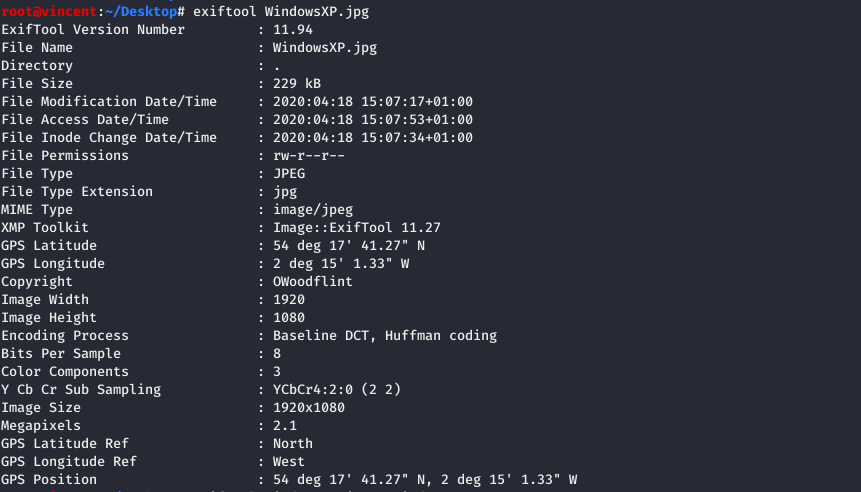
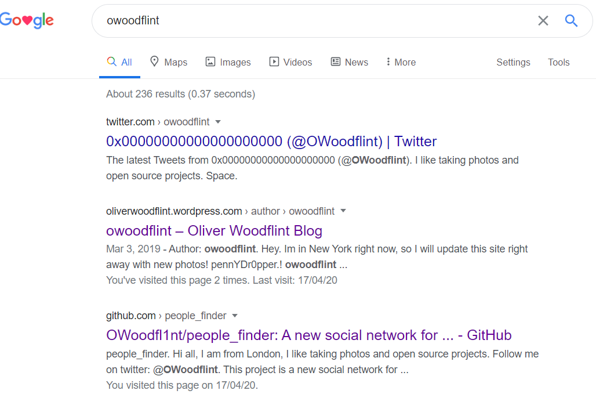
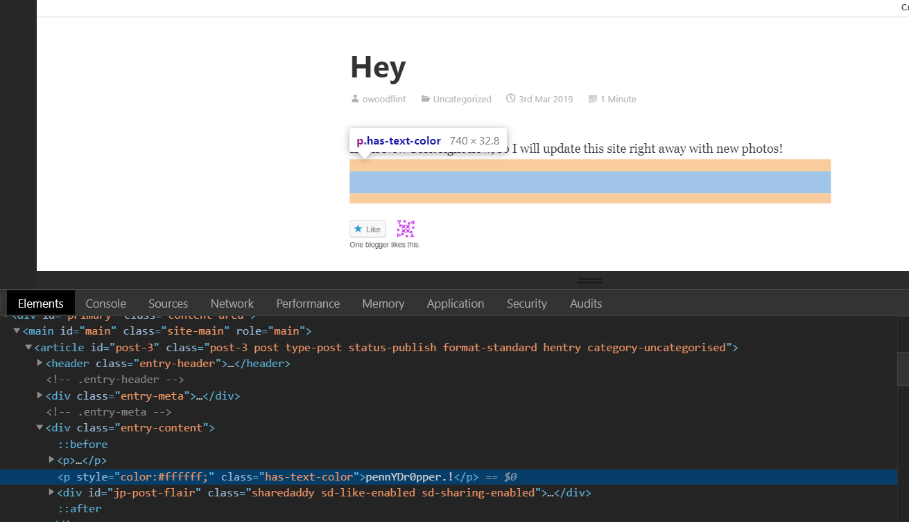

# OhSINT write-up

A [TryHackMe room](https://tryhackme.com/room/ohsint) for beginner for [open-source intelligence](https://en.wikipedia.org/wiki/Open-source_intelligence), which is the collection and analysis of _information that gathered from public, or open sources_. There is one and only task that comes with a single photo, to evaluate the amount of information we can gather from it.

## [Task 1] OhSINT 
Given the only photo below, what information can you possible get starting with just one photo ?

### #1. What is this users avatar of ?

#### Hints : 
* **exiftool** is your friend. 
* Who is the author of the image? 
* Do they have any social media accounts?

#### How to find :
* [exiftool](https://exiftool.org) is a platform-independent Perl library + a CLI application for reading, writing and editing meta information in a wide variety of file types. 
* JFIF is one of the file types it support, which thus we are using it here to view the metadata of this image.
* By using command **exiftool <source_name>** , the following metadata got returned :
  
  

* It is clear that the author is **OWoodflint** from above, we then search for the username on search engine (recommend __Google__ for searching)

* We start digging info from the Twitter account, which look like this :

    

* Hence, it is clear that the user avatars on its Twitter account is a cat

#### Solution : cat

### #2. What city is this person in ?

[Basic Service Set Identifier (BSSID)](https://www.speedcheck.org/wiki/bssid/) is used to _describe sections of a wireless local area network or WL[AN](https://www.speedcheck.org/wiki/lan/)_. 

* BSSID is simply the _MAC address of a wireless access point_ or also known as WAP
* It recognizes the access point or router because it has a unique address which creates the wireless network

#### Hint : BSSID + Wigle.net

#### How to find :
* From the very first twitter post of the author, we are able to get the **BSSID** of the WiFi router where the author stay at.
* [WiGLE](Wigle.net) (Wireless Geographic Logging Engine) allows us to consolidate location and information of wireless networks world-wide to a central database, that we can find the location with only BSSID.

* From the query result, we can see the location of the router in map

#### Solution : London

### #3. What's the SSID of the WAP he connected to ?
[Service set identifier (SSID)](https://www.speedcheck.org/wiki/bssid/#service-set-identifier-(ssid)) can be known as a unique name for certain WLAN since there are multiple WLANs that can coexist. This service set is normally customizable and more convenient as it uses English in most of the time.

#### How to find :
* It can be found from the result of the query above

#### Solution : UnileverWiFi

### #4. What is his personal email address ?

#### How to find :
* It can be found from one of the social websites of the author mentioned above. 
* Hint : Programmer's favourite social sites

#### Solution : OWoodflint@gmail.com

### #5. What site did you find his email address on ?

#### How to find :
*  The site where you found his personal email address from the question above.

#### Solution : GitHub

### #6. Where has he gone on holiday ?

#### How to find :
* It can be found on his personal website (Wordpress)
* The answer come as one of his post on the page above.

#### Solution : NewYork

### #7. What is this persons password ?

#### How to find :
* It can be found from the same post from above question
* You can find it by using browser's "**Inspect Element**", which the text is hidden by its font-colour

#### Solution : pennYDr0pper.!

## Resources :
* [About BSSID, SSID and ESSID](https://sourcedaddy.com/networking/bssid-ssid-and-essid.html)