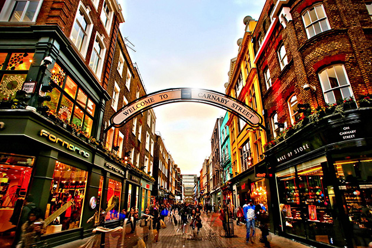
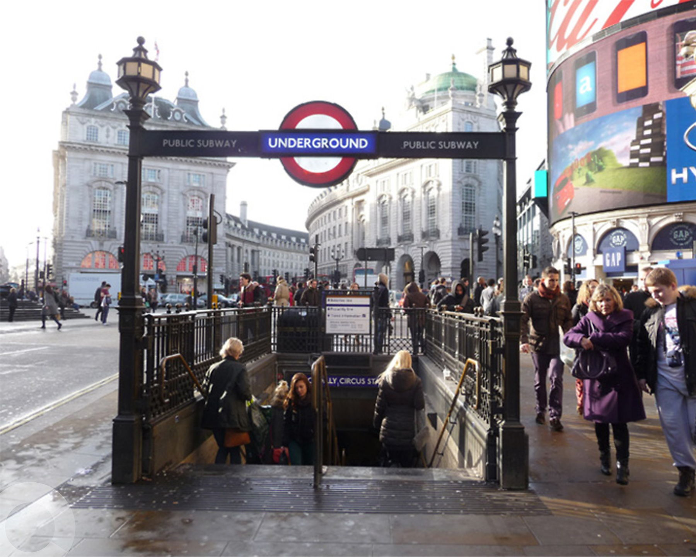
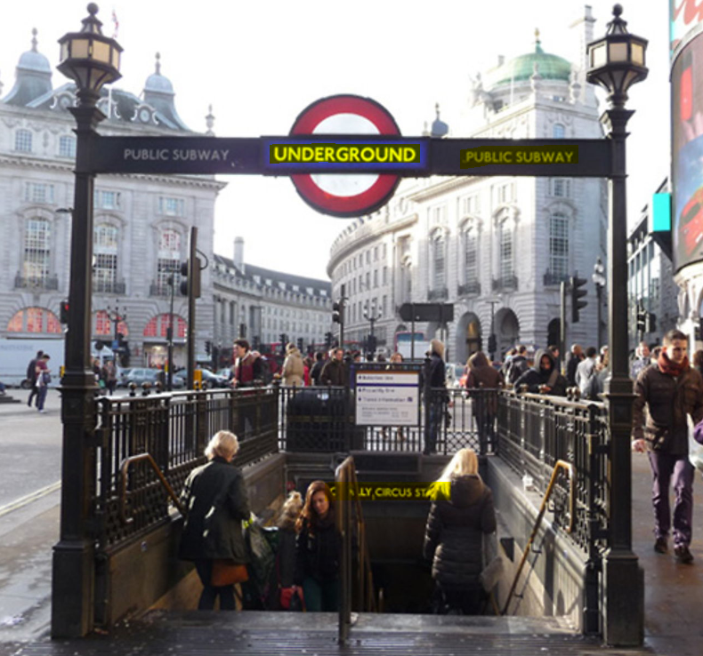
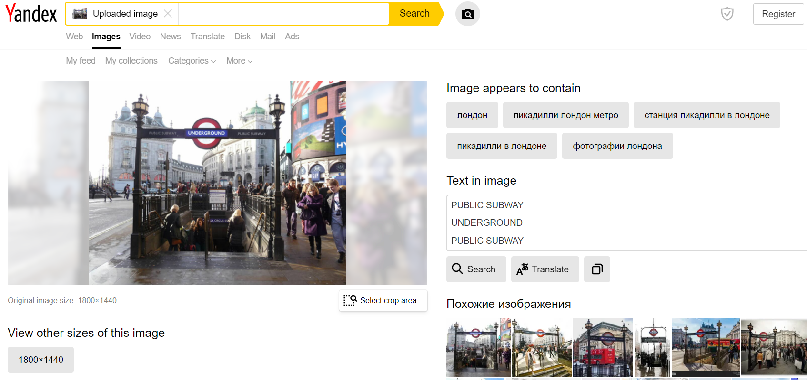
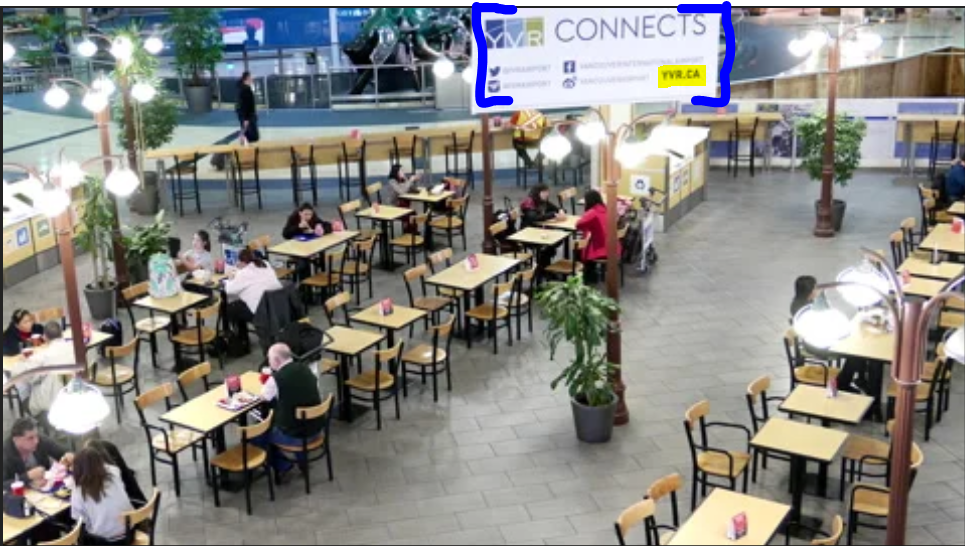
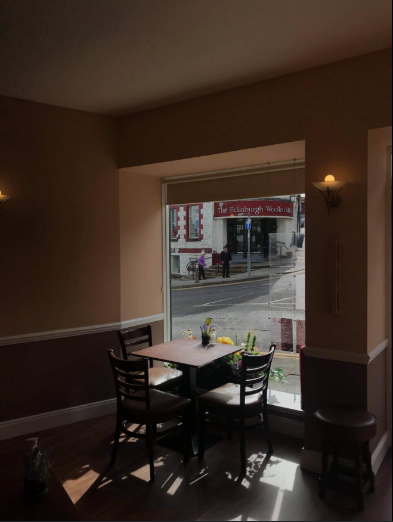

# [Searchlight - IMINT](https://tryhackme.com/room/searchlightosint)

OSINT challenges in the imagery intelligence category

__Note__ : All the flags in this challenges are in format `sl{flag}`

## [Task 2] First Challenge

Knowing that 5 elements of IMINT to notice for a geolocation challenge :

- Context
- Foreground
- Background
- Map markings
- Trial and Error

From the image given above, there is a clear street board showing the name of the street : __Cxxxxxx Sxxxxx__

## [Task 3] Just Google It

For this challenge, I got 2 different way to solve it :

1. Finding information from the image :

    

- The signboard/trademark on the picture '_UNDERGROUND_' should be obvious that it is a __London Underground__
- You can find the metro sign from this [list](https://en.wikipedia.org/wiki/List_of_metro_systems) of metro systems
- You can see an incompleted sentence '_LY CIRCUS STA_' nearby the stairs
- Since it is a underground station, thus you can expect the station is called 'something _CIRCUS STATION_'
- Try to search for this term on the search engine, and look closely to the similar associated images, and you should be able to find this London-based metro station

2. Using Yandex Search Engine :

- [Yandex](https://yandex.com) is Russian-based search image, and the advantage is that its image search is based on Machine Learning, instead of originality-search like Google Search.
- It returns a list of information from the image analysis, such as 'Text in image', 'Similar Images' and 'Sites where the image occurs'
- The analysis result looks like this :
  
- The analysis result on Yandex should have give you sufficient information to solve this challenge
- More information about Yandex can be found on another THM room [Geolocating Image](https://tryhackme.com/room/geolocatingimages)

## [Task 4] Keep at it

- Just pay attention to the hightlighted part and search about related terms, then you may get the results
- __Hint__ : The URL link on the signboard ended with __.CA__, which means it is a website with domain in _Canada_

## [Task 5] Coffee and A Light Lunch

This task is a little tough comparing to those previous tasks, while

- You can find quite a big shopsign across the street, showing '__The Edinburgh Woollen Mill__'
- Search for the shop on Google Map, and focusing on __Scotland__ area (hint given in the task question)
- Another hint here : there is a _national park_ 'nearby' (on the map)
- The _email address_ of the coffee shop is __NOT__ on the Google Map, but it can be found on their FB page (link provided on Google Map)
- Look into the _review_ about this coffee shop and find out who is replying to those reviews
- _PS : Looks like a lovely family-run coffee shop, and hopefully they can go through this hard period_

## [Task 6] Reverse your thinking

- Reverse image search by using various search engines (both Google Image and Yandex work for me)
- Search for the restaurant name on Youtube (given in the hint) to find a video made by _Bon Appetit_

## [Task 7] Locate this sculpture

- By using Google Translate to search for the hint given, it is written in _Norwegian_, and thus we can assume that this statue is located somewhere in Norway
- By using reverse image searching method with Yandex, we can confirm that the statue is located in __Oslo__
- Find all the outdoor statues in that place, and you should be able to find the name of the statue in the given image

## [Task 8] ...and justice for all

- Google Images and Google Map are your friends in this task
- By reverse image searching method, you should be able to find the name of the statue
- Finding an image of this statue from a further angle that will allow you to see the name of the building
- __Hint 1__ : the name of the building is actually _above the statue itself_
- __Hint 2__ : the building opposite is a _hotel_

## [Task 9] The View From My Hotel Room

- From the video you can tell that the hotel is in __Singapore__, since there is __Marina Bay__ building.
- Other than that, you can also see the signboard '_Riverside Point_' on your _right hand side_ and '_Clark Quay Central_' __in front__ of the accommodation
- There is a green field (actually a __park__) on the _left hand side_ of the hotel
- To find out the location without any external tool, you can try linking the locations with relevant terms mentioned above on Google Map, and try to find the direction of the recorder
- __Note 1__ : The issue of finding this place is that this hotel is currently '__Permanently closed__', thus it's harder to find (found out on __23 December 2020__)
- __Note 2__ : This location is not assigned with the word 'hotel' in its title, so you have to add it by your own in front the place name, ie. __sl{hotel (location_name_here)}__
- __Hint__ : There are _3 parks nearby_ this place on map
