# CC : Steganography CTF write-up
An easy-level TryhHackMe [crash course room](https://tryhackme.com/room/ccstego), that have an introduction on various steganography open-source tools.

## Author
* [Ee En Goh](https://tryhackme.com/p/vincentwu)

## [Task 1] Introduction 
Steganography is the practice of concealing a file message, image or video within anothers. It is used to deliver messages without authorized person to find it out.  

The file format involved be :
1. Images
   * [JPEG](https://en.wikipedia.org/wiki/JPEG) file
   * [PNG](https://en.wikipedia.org/wiki/Portable_Network_Graphics) file
2. Audio
   * [WAV](https://en.wikipedia.org/wiki/WAV) file

One thing to point out is that all the following tools are operated on linux, thus ___basic linux and bash knowledge is required___.

There can be couple available solution to the same question, but take notes of the acceptable solution length (ie. __no. of *__ on the question's placeholder)

## [Task 2] Steghide
Steghide is a steganography tool that allows you to cover up confidential records inside a picture or sound record with a passphrase. Support formats are [BMP](https://en.wikipedia.org/wiki/BMP_file_format) and JPEG for images, [AU](https://en.wikipedia.org/wiki/Au_file_format) and WAV for sound groups.

Most of the solutions below can be found by reviewing the software documentation with command 
```Bash 
man steghide
```

### #1. What argument allows you to embed data(such as files) into other files?

#### Solution : embed
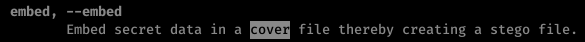

### #2. What flag let's you set the file to embed?
The embedded file is the message to be keep secret

#### Solution : -cf
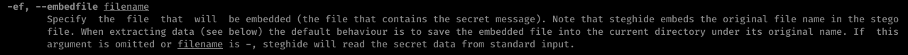

### #3. What flag allows you to set the "cover file"? (i.e  the jpg)
The cover file is the hide-out of the message, as the transferred file

#### Solution : -cf
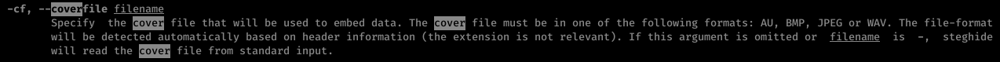

### #4. How do you set the password to use for the cover file?
The combination of steganography and cryptography makes the embedded message to be more secure.

#### Solution : -p
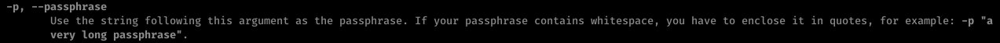

### #5. What argument allows you to extract data from files?

#### Solution : extract
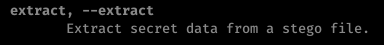

### #6. How do you select the file that you want to extract data from?

#### Solution : -sf
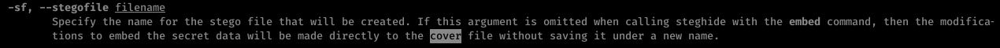

### #7. Given the passphrase "password123", what is the hidden message in the included "jpeg1" file ?


#### How to solve :
1. To find out the embedded file within, argument ***extract*** is required
2. For extract action, stegofile and extracted file must be specified, hence options __-sf <_stegofile_> & -xf <_extractfile_>__
3. Passphrase is given, means that the embedded message/file is encrypted with certain password, thus option **-p <_password_>** is required
4. ___cat___ is the command to view a content within the specified file

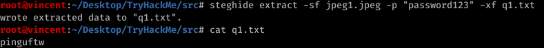
#### Solution : pinguftw

## [Task 3] [zsteg](https://github.com/zed-0xff/zsteg)
Zsteg is just similar to steghide, while it supports **PNG image file format** instead of JPEG.

Most of the solutions below can be found by reading their usage documentation, with command 

```Bash
zsteg -h
```

### #1. How do you specify that the least significant bit comes first ?

#### Solution : --lsb

### #2. What about the most significant bit ?

#### Solution : --msb


### #3. How do you specify verbose mode?

#### Solution : -v

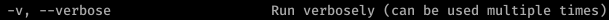

### #4. How do you extract the data from a specific payload?

#### Solution : -E

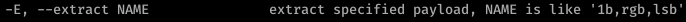

### #5. In the included file "png1" what is the hidden message?

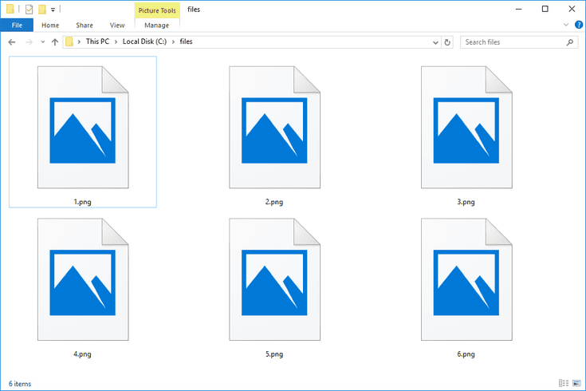

#### How to find :
1. To think about hidden message, I firstly think of extracting strings from the image, that leads me to option **-s**
2. Since I have no clue the range of string extraction needed, I choose to find out **all**
3. From the output, the text string element caught my eye, which it has the same length as required solution.

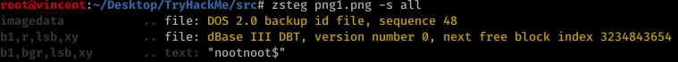

#### Solution : nootnoot$

### #6. What about the payload used to encrypt it ?
The payload here is basically the information on the LHS of the info, that used to describle how the info came from the image.

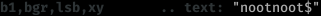

#### Solution : b1,bgr,lsb,xy

## [Task 4] [Exiftool](https://github.com/exiftool/exiftool)
Exiftool is a CLI tool written in Perl, that allows you to read, write or create meta information in a variety of file format, inclding PDF, MP4 and JPEG.

Its documentation can be found with command :
```Bash
   man exiftool
```

## #1. In the included jpeg3 file, what is the document name ?


### How to find :
* The steps here are straight forward, which most of the metadata are returned by default, ie. ```  exiftool <file> ```

### Solution : Hello :)

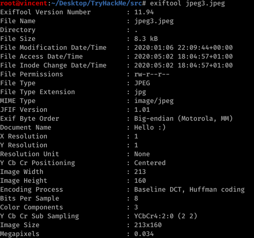

## [Task 5] [Stegoveritas](https://github.com/bannsec/stegoVeritas)
Stegoveritas is a general steganography tool written in Python, which support almost every image file format, and be able to extract all types of embedded data within. Also, it has other features like color correcting images.

Documentation about this tool can be found by using command
```Bash
   stegoveritas -h
```

### #1. How do you check the file for metadata ?

#### Solution : -meta
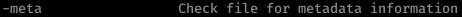

### #2. How do you check for steghide hidden information ? 

#### Solution : -steghide
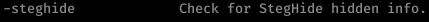

### #3. What flag allows you to extract LSB data from the image ?

#### Solution : -extractLSB


### #4. In the included image jpeg2 what is the hidden message?

#### Hint : "Found something with StegHide:"
#### How to find :
1. According to the given hint, it should be taking about option __-steghide__ to extract hidden info within.
   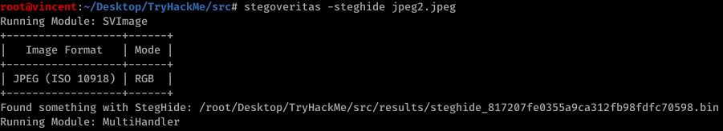
2. The extracted data is returned as a _.bin file_, thus by using command __cat__ :
   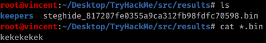

#### Solution : kekekekek

## [Task 6] Spectrograms
Spectrogram stegonography is a way to hide an image within an audio file, by using the [spectogram effect](https://en.wikipedia.org/wiki/Spectrogram) from the audio frequency.

### #1. What is the hidden text in the included wav2 file ?
#### Solution : google

## [Task 7] The Final Exam
Basically this task is just the review of those previous tasks in this room, except the last question, which is actually using the color modification to achieve it. 

Each task resource is given on the deployed site, and a form to fill in the key, in order to progress to the next question.

### #1. What is key 1 ?

#### Source :


#### How to find :
1. I start my information digging from all metadata of the image, including extract the [EXIF (Exchangeable image file format)](https://en.wikipedia.org/wiki/Exif) of the image, with option ___-exif of stegoveritas___
2. The document name I got gives me an idea that the embedded message/file, is encrypted with passphrase.
   
3. Then, I use steghide to extract the embedded message with option __-p__ to input the passphrase and decrypt it.
   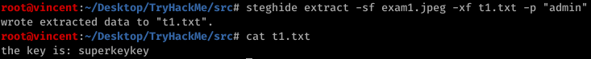
   
#### Solution : superkeykey

### #2. What is key 2 ?

#### Source : [exam2.wav](./src/exam2.wav)

#### How to find :
1. Given a WAV format audio file, clearly we will think about the spectrogram of it. (Note the spectrogram isn't clear enough by default, enlargement is required)
   
   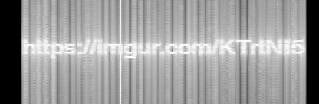
2. An image is found from the given URL, which is a standing red colour pencil.
   
   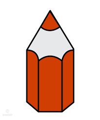

3. Since the image is in PNG format, the first tool in mind will be zsteg, and extract all string with option __-s all__
   
   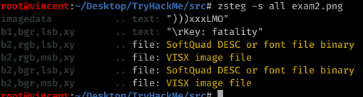
   
#### Solution : fatality

### #3. What is key 3 ?

#### Source :
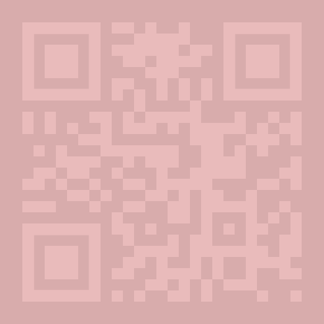

#### How to find :
1. Since the given source is a QR code, hence I assume the key can be found by scanning the QR code and got redirected to a URL that contains it
2. However, since the colouring difference of those 2 kind of colours that form the QR code is slight, hence the colouring has to be transformed, which can be done by __stegoveritas, with option -imageTransform__
   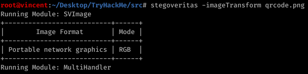
3. A directory will be returned with the results of all possible transformation on the images, where you find the appropriate QR code for scanning
   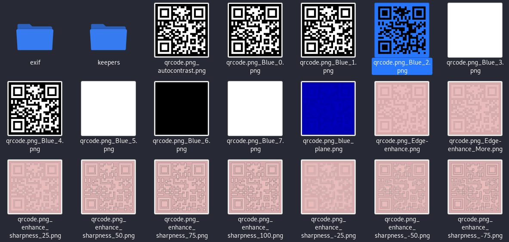
4. The key can be found on the URL from the QR code scanning

#### Solution : killshot